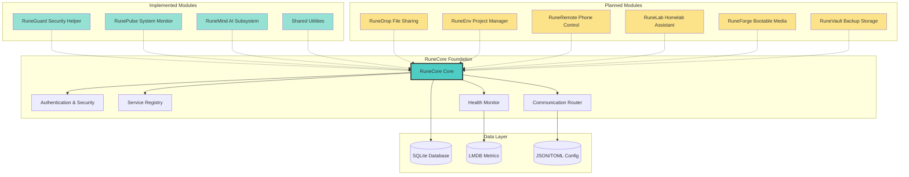
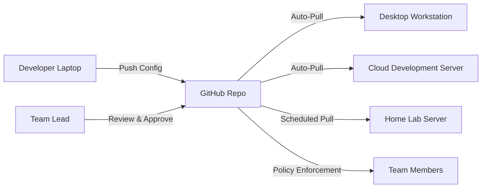
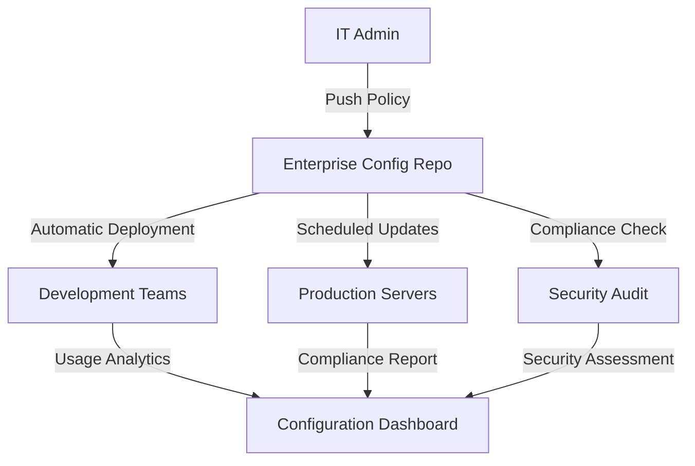
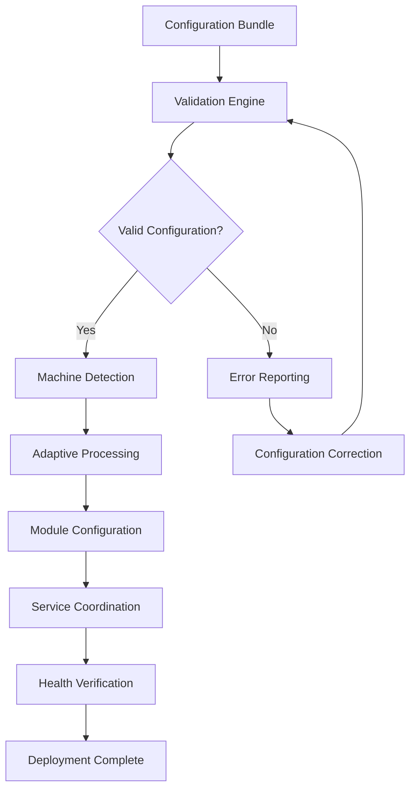
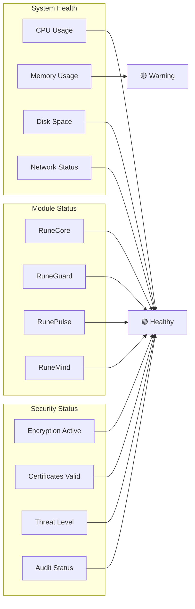

# RuneCore Ecosystem

> **Status:** Foundation Development | **Platform:** WSL2, Arch Linux, Debian/Ubuntu  
> **Architecture:** Modular Microservice Environment  
> **Last Updated:** October 19, 2025

RuneCore is a modular personal computing environment built around a central core system. It provides integrated tools for system management, development, file sharing, and cross-device control through a unified, secure ecosystem.

## System Architecture



## Core Architecture

### Foundation Components
- **Central RuneCore**: Mandatory foundation managing all module interactions
- **Configuration Management**: Unified configuration system for entire ecosystem portability
- **Microservice Modules**: Independent services connecting through the core
- **Encrypted Communication**: AES-256 encryption for all inter-module communication
- **Service Discovery**: Core-managed registry for module location and health
- **Local Storage**: SQLite, LMDB, and configuration files - all data stays local

### Security Implementation
- **AES-256 Encryption**: Industry-standard encryption for data in transit
- **Public Key Infrastructure**: Core-managed certificate and key rotation
- **Weekly Key Rotation**: Automated security certificate renewal
- **Privilege Separation**: Modules operate at minimum required access levels
- **Local Data Only**: No cloud dependencies, all data remains on user machine

### Communication Protocol
- **JSON Messaging**: Standardized message format across all modules
- **WebSocket Connections**: Real-time communication channels
- **Core-Enforced Standards**: All module communication routed through core
- **Graceful Degradation**: Modules function independently when core unavailable

## Module Status

### Implemented (Foundation Phase)

#### RuneCore Foundation (Planned - Central Architecture)
- **Service Registry**: Module discovery and registration
- **Configuration Manager**: Unified ecosystem configuration and portability system
- **Remote Configuration Service** *(Optional)*: Git-based configuration synchronization for multi-machine and enterprise deployments
- **Authentication System**: Security and access management  
- **Inter-Module Router**: Communication coordination
- **Health Monitoring**: Real-time system status tracking
- **Error Logging**: Centralized error collection and analysis

#### RuneGuard Security Helper (ErrorLogger → RuneGuard)
- **Error Monitoring**: System-wide error detection and logging
- **State Snapshotting**: Diagnostic data collection
- **Network Monitoring**: Basic traffic analysis capabilities
- **Help System**: Automated troubleshooting assistance

#### RunePulse System Monitor (hidden_toolbar → RunePulse)
- **System Metrics**: CPU, RAM, disk, network monitoring
- **TUI Interface**: Simple and advanced monitoring modes
- **Health Presets**: Gaming, Development, Minimal configurations
- **Status Indicators**: Green/Yellow/Red system health display

#### RuneMind AI Subsystem (ai_service → RuneMind)
- **Natural Language Interface**: Chat-based system interaction
- **Multiple AI Models**: Ollama integration with model management
- **System Optimization**: AI-driven performance suggestions
- **Conversation Memory**: Context-aware interaction history

#### RuneCore Shared Utilities (shared_utils)
- **Common Libraries**: Cross-module utility functions
- **Configuration Management**: Standardized settings handling
- **Communication Helpers**: Inter-module messaging utilities
- **Security Primitives**: Encryption and authentication helpers

### Planned Modules

#### RuneDrop File Sharing
- **QR Code Transfer**: Drag-to-tray file sharing via QR codes
- **Priority Handling**: Smart file type prioritization
- **Cross-Device Pairing**: Seamless device-to-device connections
- **Zero-Config Discovery**: Automatic local network detection

#### RuneEnv Project Manager  
- **Environment Automation**: Automated dev environment setup
- **Container Management**: Docker/Podman integration
- **Dependency Tracking**: Project-specific package management
- **IDE Integration**: Development tool coordination

#### RuneRemote Phone Control
- **Native Mobile App**: Kotlin/React Native implementation
- **Media Controls**: System audio and video management
- **Stream Deck**: Customizable control interface
- **Multi-Computer Support**: Cross-system device pairing

#### RuneLab Homelab Assistant
- **Server Monitoring**: Change tracking and logging
- **Backup Reminders**: Automated backup scheduling
- **SSH Management**: Connection monitoring and status
- **Quick Cards**: Server status dashboard

#### RuneForge Bootable Media Creator
- **Rufus-like Capability**: Create bootable USB drives with modern UI
- **ISO Management**: Download, verify, and catalog operating system images
- **Ventoy Integration**: Advanced multi-boot USB creation and management
- **Custom Images**: Support for custom rescue disks and deployment images
- **Cross-Platform Compatibility**: Windows, Linux, and macOS bootable media support
- **Verification Tools**: SHA256/MD5 checksum validation and image integrity checks
- **Multi-Boot Configuration**: Intelligent boot menu creation and customization
- **Enterprise Features**: Unattended installation support and deployment automation

#### RuneVault External Backup Storage
- **External Drive Management**: Automated backup to USB drives, external HDDs, and NAS devices
- **Cloud Storage Integration**: Secure backup to user-owned cloud storage (Google Drive, Dropbox, OneDrive, S3)
- **Incremental Backups**: Smart differential backups to minimize storage usage and transfer time
- **Encryption & Security**: AES-256 encryption for all backup data, both local and cloud
- **Backup Scheduling**: Flexible scheduling with smart triggers (system changes, file modifications)
- **Disaster Recovery**: One-click system restore from backup archives
- **Multi-Destination Sync**: 3-2-1 backup strategy with multiple storage destinations
- **Backup Verification**: Automatic integrity checks and restoration testing

---

## RuneCore Configuration Management: Universal Ecosystem Portability

### Overview
The RuneCore Configuration Management system provides a unified, portable configuration framework that allows users to set up their entire RuneCore ecosystem once and seamlessly deploy it across multiple systems with complete consistency.

### Core Concept

#### Unified Configuration Architecture
- **Single Source of Truth**: One configuration bundle defines the entire ecosystem
- **Cross-System Portability**: Export/import configurations between different machines
- **Version Control Ready**: Git-friendly configuration format for tracking changes
- **Environment Adaptation**: Smart adaptation to different system capabilities and constraints
- **Hierarchical Overrides**: Global, module-specific, and machine-specific configuration layers

#### Configuration Bundle Structure
```
runecore-config/
├── core.toml                 # Core system settings
├── modules/                  # Module-specific configurations
│   ├── runemind.toml         # AI subsystem settings
│   ├── runeguard.toml        # Security configuration
│   ├── runepulse.toml        # Monitoring settings
│   ├── runedrop.toml         # File sharing configuration
│   ├── runeenv.toml          # Project management settings
│   ├── runeremote.toml       # Mobile/remote control
│   ├── runelab.toml          # Homelab assistant
│   ├── runeforge.toml        # Bootable media creator
│   └── runevault.toml        # Backup storage settings
├── profiles/                 # Environment-specific profiles
│   ├── development.toml      # Development environment overrides
│   ├── production.toml       # Production environment settings
│   ├── homelab.toml          # Homelab-specific configuration
│   └── minimal.toml          # Lightweight/resource-constrained setups
├── machines/                 # Machine-specific overrides
│   ├── desktop-workstation.toml
│   ├── laptop-mobile.toml
│   └── server-headless.toml
├── templates/                # Configuration templates and presets
│   ├── gaming-setup.toml
│   ├── development-stack.toml
│   ├── security-focused.toml
│   └── homelab-manager.toml
└── metadata.toml            # Bundle metadata and validation
```

### Key Features

#### Configuration Portability
- **Export/Import System**: One-click configuration bundle creation and deployment
- **Machine Discovery**: Automatic detection of system capabilities and constraints
- **Adaptive Configuration**: Smart adjustment of settings based on available resources
- **Conflict Resolution**: Intelligent handling of incompatible settings across systems
- **Rollback Support**: Configuration versioning with easy rollback to previous states

#### Environment Management
- **Profile System**: Pre-defined configuration profiles for different use cases
- **Dynamic Switching**: Runtime switching between configuration profiles
- **Inheritance Model**: Configuration inheritance with override capabilities
- **Validation Framework**: Comprehensive configuration validation before deployment
- **Migration Tools**: Automated migration between configuration versions

#### Security & Encryption
- **Encrypted Bundles**: AES-256 encryption for sensitive configuration data
- **Key Management**: Secure handling of API keys, certificates, and credentials
- **Access Control**: Fine-grained permissions for configuration modification
- **Audit Logging**: Complete tracking of configuration changes and deployments
- **Secure Synchronization**: Encrypted configuration sync between authorized systems

#### Remote Configuration Synchronization (Optional Microservice)
- **Git-Based Automation**: Automatic configuration sync via GitHub/GitLab repositories
- **Multi-Machine Orchestration**: Push configuration changes to multiple systems simultaneously
- **Enterprise Policy Management**: Central configuration enforcement for organizational standards
- **Personal Cloud Sync**: Seamless configuration updates across personal device ecosystem
- **Selective Synchronization**: Choose which configuration components to sync remotely vs keep local

### Integration with RuneCore Ecosystem

#### Core System Integration
- **Centralized Management**: Configuration managed as core RuneCore function
- **Service Coordination**: Automatic service restart and reconfiguration on changes
- **Health Monitoring**: Configuration health checks and consistency validation
- **Hot Reloading**: Runtime configuration updates without system restart
- **Dependency Management**: Automatic handling of inter-module configuration dependencies

#### Module-Specific Features
```toml
# Example: RuneMind AI Configuration
[runemind]
enabled = true
default_model = "llama2:7b"
max_context_tokens = 4096
temperature = 0.7
api_endpoints = ["http://localhost:11434"]

[runemind.models]
download_on_startup = ["llama2:7b", "codellama:13b"]
auto_update = true
storage_path = "/var/lib/runecore/models"

[runemind.security]
api_key_required = false
rate_limit = "100/hour"
allowed_origins = ["localhost:3000"]

# Example: RuneVault Backup Configuration  
[runevault]
enabled = true
strategy = "3_2_1_backup"
encryption = "aes256_user_managed"

[runevault.destinations]
primary = { type = "external_drive", path = "/media/backup-drive" }
secondary = { type = "cloud", provider = "google_drive", folder = "RuneCore-Backups" }
tertiary = { type = "nas", address = "192.168.1.100", share = "backups" }

[runevault.schedule]
full_backup = "weekly"
incremental_backup = "daily"
retention = "30_days_local_1_year_cloud"
```

#### Cross-System Scenarios
- **Developer Workflow**: Identical development environment across laptop, desktop, and cloud instances
- **Homelab Management**: Consistent configuration across multiple servers and workstations  
- **Team Deployment**: Standardized RuneCore setup for development teams
- **Disaster Recovery**: Rapid system reconstruction from configuration bundles
- **Testing Environments**: Quick provisioning of test systems with known configurations

### Configuration Templates

#### Gaming-Optimized Setup
```toml
[template.gaming]
name = "Gaming Performance Setup"
description = "Optimized for gaming performance and system monitoring"

[template.gaming.runepulse]
monitoring_interval = "1s"
performance_mode = "gaming"
overlay_enabled = true

[template.gaming.runemind]
enabled = false  # Disabled to conserve resources

[template.gaming.runeguard]
real_time_protection = true
game_mode_optimization = true
```

#### Development Environment
```toml
[template.development]
name = "Full Development Stack"
description = "Complete development environment with all tools"

[template.development.runeenv]
auto_containerization = true
ide_integration = ["vscode", "intellij", "vim"]
language_support = ["python", "javascript", "go", "rust"]

[template.development.runemind] 
code_completion_enabled = true
documentation_assistant = true
model_preference = "codellama:13b"

[template.development.runevault]
project_backup_enabled = true
git_integration = true
```

#### Security-Focused Configuration
```toml
[template.security]
name = "Security Professional Setup"  
description = "Enhanced security monitoring and protection"

[template.security.runeguard]
threat_detection = "maximum"
network_monitoring = "aggressive"
forensic_logging = true

[template.security.runeforge]
security_tools_enabled = true
penetration_testing_images = true

[template.security.runevault]
encryption = "aes256_military_grade"
air_gap_backup = true
```

### Remote Configuration Service (Optional Microservice)

#### Overview
The Remote Configuration Service is an optional, lightweight microservice that enables automated configuration synchronization across multiple machines using Git repositories as the backend. This service bridges personal multi-device workflows and enterprise configuration management needs.

#### Architecture Design
- **Opt-In Service**: Completely optional - RuneCore functions fully without it
- **Lightweight Footprint**: Minimal resource usage, runs as background service
- **Git-Native**: Leverages existing Git infrastructure (GitHub, GitLab, Gitea, self-hosted)
- **Zero-Config Setup**: Works out-of-the-box with sensible defaults
- **Privacy-First**: All synchronization happens through user-controlled repositories

#### Core Functionality

##### Personal Use Cases
```toml
# Personal sync configuration
[remote_sync]
enabled = true
mode = "personal"
repository = "https://github.com/username/runecore-configs.git"
branch = "main"
sync_interval = "1h"
auto_pull = true
auto_push = false  # Manual push for safety

[remote_sync.components]
sync_modules = ["runemind", "runevault", "runepulse"]
exclude_sensitive = true  # Exclude API keys, passwords
sync_machine_specific = false  # Don't sync hardware-specific configs
```

##### Enterprise Use Cases
```toml
# Enterprise policy enforcement
[remote_sync]
enabled = true
mode = "enterprise"
repository = "https://github.com/company/runecore-standard.git"
branch = "production"
policy_enforcement = true
local_overrides = "limited"  # Only allow specific local customizations

[remote_sync.enterprise]
mandatory_modules = ["runeguard", "runepulse"]  # Required by policy
update_window = "02:00-04:00"  # Maintenance window for updates
compliance_reporting = true
approval_workflow = "pull_request"  # Changes require PR approval
```

#### Synchronization Modes

##### Pull-Only Mode (Enterprise Standard)
- **Central Authority**: Enterprise IT maintains master configuration
- **Policy Enforcement**: Automatic application of organization-wide standards
- **Compliance Monitoring**: Track which systems are compliant with current policy
- **Scheduled Updates**: Apply updates during designated maintenance windows
- **Override Controls**: Limit which settings users can modify locally

##### Bidirectional Sync (Personal/Team)
- **Collaborative Configuration**: Team members can contribute configuration improvements
- **Conflict Resolution**: Intelligent merging of configuration changes from multiple sources
- **Change Tracking**: Full audit trail of who made what changes when
- **Rollback Capability**: Easy reversion to previous configuration states
- **Selective Sync**: Choose which machines contribute changes vs consume only

##### Hybrid Mode (Advanced Organizations)
- **Tiered Authority**: Different sync rules for different user roles
- **Environment Segregation**: Separate sync channels for dev/staging/production
- **Approval Workflows**: Configuration changes require review before propagation
- **Gradual Rollouts**: Test configuration changes on subset before full deployment

#### Security Model

##### Repository Security
```toml
[remote_sync.security]
# Repository access control
ssh_key_authentication = true
gpg_signed_commits = true
encrypted_sensitive_data = true  # Encrypt secrets before commit

# Access patterns  
read_only_repositories = ["company/runecore-base"]
read_write_repositories = ["team/runecore-shared"]
private_repository = "personal/runecore-private"

# Validation
signature_verification = "required"
trusted_contributors = ["admin@company.com", "devops@company.com"]
automatic_security_scanning = true
```

##### Data Protection
- **Selective Encryption**: Automatically encrypt sensitive configuration data
- **Key Isolation**: API keys and secrets never leave local machine
- **Sanitized Commits**: Remove sensitive data before pushing to remote
- **Access Logging**: Complete audit trail of all remote sync operations
- **Network Security**: TLS 1.3 for all remote communications

#### Integration Scenarios

##### Developer Workflow


##### Enterprise Deployment


#### Service Architecture

##### Microservice Components
- **Configuration Watcher**: Monitor local configuration changes
- **Git Synchronizer**: Handle repository operations (clone, pull, push, merge)
- **Conflict Resolver**: Intelligent handling of configuration conflicts  
- **Policy Engine**: Enforce enterprise policies and restrictions
- **Security Scanner**: Validate configurations before sync operations

##### Integration Points
- **RuneCore Core**: Register as configuration change listener
- **ErrorLogger**: Log all sync operations and errors
- **Health Monitor**: Service health checks and status reporting
- **Web UI**: Optional web interface for sync status and manual operations
- **CLI Tools**: Command-line interface for advanced sync management

#### Configuration Templates

##### Personal Multi-Device Setup
```bash
# Quick setup for personal use
runecore config remote-sync init \
  --mode personal \
  --repository git@github.com:username/runecore-configs.git \
  --auto-pull \
  --exclude-sensitive \
  --sync-interval 30m
```

##### Enterprise Policy Enforcement
```bash
# Enterprise deployment
runecore config remote-sync init \
  --mode enterprise \
  --repository https://github.com/company/runecore-standard.git \
  --policy-enforcement \
  --compliance-reporting \
  --update-window "02:00-04:00" \
  --approval-workflow pull_request
```

##### Hybrid Team Setup
```bash
# Team collaboration with approval workflow
runecore config remote-sync init \
  --mode hybrid \
  --base-repository https://github.com/company/runecore-base.git \
  --team-repository https://github.com/team/runecore-shared.git \
  --personal-repository git@github.com:username/runecore-personal.git \
  --approval-required \
  --gradual-rollout
```

#### Benefits & Use Cases

##### Personal Benefits
- **Effortless Sync**: Set up RuneCore once, enjoy everywhere
- **Device Consistency**: Identical experience across laptop, desktop, server
- **Backup & Recovery**: Configuration automatically backed up to Git
- **Version History**: Track evolution of your RuneCore setup over time
- **Selective Sharing**: Share specific configurations while keeping others private

##### Enterprise Benefits  
- **Standardization**: Ensure all employees use approved RuneCore configurations
- **Compliance**: Automated enforcement of security and operational policies
- **Rapid Deployment**: New employee onboarding with pre-configured RuneCore
- **Change Management**: Controlled rollout of configuration updates
- **Audit & Reporting**: Complete visibility into configuration compliance

##### Advanced Scenarios
- **Multi-Environment Management**: Different configs for dev/staging/prod
- **Role-Based Configuration**: Different setups for developers, admins, analysts
- **Gradual Migration**: Smooth transition when updating RuneCore standards
- **Disaster Recovery**: Rapid restoration of entire team's configurations
- **Configuration Testing**: A/B testing of different RuneCore setups

### Implementation Architecture

#### Configuration Engine
- **Parser Framework**: Multi-format support (TOML, YAML, JSON)
- **Validation Engine**: Schema validation and constraint checking  
- **Merge Logic**: Intelligent configuration merging and conflict resolution
- **Template System**: Dynamic template expansion and customization
- **Migration Framework**: Automated configuration format upgrades

#### Deployment Pipeline


#### Runtime Management
- **Hot Configuration Updates**: Runtime reconfiguration without service interruption
- **Configuration Monitoring**: Real-time tracking of configuration drift and changes
- **Automatic Healing**: Self-correction of configuration inconsistencies
- **Performance Optimization**: Configuration-based performance tuning
- **Resource Management**: Dynamic resource allocation based on configuration

### Use Cases

#### Individual User Scenarios
- **Multi-Device Consistency**: Same RuneCore setup across desktop, laptop, and server
- **Environment Switching**: Quick switching between work, gaming, and development configurations
- **System Migration**: Seamless migration to new hardware with identical setup
- **Backup & Restore**: Configuration backup as part of disaster recovery strategy

#### Team & Enterprise Scenarios  
- **Standardized Deployments**: Consistent RuneCore setup across development teams
- **Environment Provisioning**: Rapid provisioning of new development/testing environments
- **Configuration Compliance**: Ensure all systems meet organizational security standards
- **Change Management**: Controlled rollout of configuration updates across infrastructure

#### Advanced Scenarios
- **A/B Configuration Testing**: Compare performance of different configuration profiles
- **Conditional Configurations**: Environment-specific configurations with smart activation
- **Configuration as Code**: Git-based configuration management with CI/CD integration
- **Multi-Tenant Setup**: Different configurations for different user roles or projects

### Development Roadmap

#### Priority 1: Core Configuration Framework
- [ ] Basic TOML-based configuration system
- [ ] Configuration validation and schema definition
- [ ] Simple export/import functionality
- [ ] Core module configuration integration

#### Priority 2: Advanced Features & Remote Sync Foundation
- [ ] Configuration templates and profiles
- [ ] Machine-specific adaptation logic  
- [ ] Hot reloading and runtime updates
- [ ] Configuration versioning and rollback
- [ ] **Remote Configuration Service (Optional Microservice)**
  - [ ] Git-based synchronization backend
  - [ ] Personal multi-device sync capability
  - [ ] Basic conflict resolution and merging

#### Priority 3: Enterprise Features & Policy Management
- [ ] Encrypted configuration bundles
- [ ] Multi-environment management
- [ ] Configuration compliance and auditing
- [ ] Team collaboration features
- [ ] **Enterprise Remote Sync Features**
  - [ ] Policy enforcement and compliance monitoring
  - [ ] Approval workflows and change management
  - [ ] Role-based configuration access control
  - [ ] Automated security scanning and validation

#### Priority 4: Advanced Automation & Intelligence
- [ ] AI-powered configuration optimization
- [ ] Automatic configuration drift detection
- [ ] Performance-based configuration tuning
- [ ] Complete ecosystem integration
- [ ] **Advanced Remote Sync Capabilities**
  - [ ] Hybrid sync modes and tiered authority
  - [ ] Gradual rollout and A/B configuration testing
  - [ ] Advanced analytics and configuration insights
  - [ ] Zero-downtime configuration migrations

### Security & Privacy
- **Encrypted Storage**: All sensitive configuration data encrypted at rest
- **Secure Transport**: TLS 1.3 for configuration synchronization
- **Access Control**: Role-based access to configuration management
- **Audit Trail**: Complete logging of all configuration changes
- **Key Management**: Secure handling of encryption keys and credentials

---

## RuneForge: Bootable Media Creation Suite

### Overview
RuneForge brings enterprise-grade bootable media creation to the RuneCore ecosystem, combining the simplicity of Rufus with advanced features for power users and system administrators.

### Core Features

#### Universal Bootable Media Creation
- **Modern UI**: Clean, intuitive interface inspired by Rufus but with RuneCore integration
- **Multi-Format Support**: Create bootable USB drives, SD cards, and external drives
- **Cross-Platform Images**: Windows, Linux, macOS, and custom rescue environments
- **Smart Detection**: Automatic USB device detection and capacity verification

#### Ventoy Advanced Integration
- **Native Ventoy Support**: Create and manage Ventoy multi-boot USB drives
- **ISO Collection Management**: Organize and categorize bootable images
- **Persistent Storage**: Configure persistent storage for live Linux distributions
- **Custom Themes**: Ventoy boot menu customization and branding
- **Plugin System**: Advanced Ventoy plugins and configuration management

#### Enterprise & Advanced Features
- **Image Verification**: SHA256, MD5, and cryptographic signature validation
- **Network Deployment**: PXE boot server integration and network installations
- **Unattended Installations**: Automated Windows and Linux deployment configurations
- **Custom Image Building**: Create rescue disks with RuneCore tools pre-installed
- **Batch Operations**: Mass USB creation for enterprise deployments

#### Integration with RuneCore Ecosystem
- **RuneMind AI**: AI-powered image recommendations and troubleshooting
- **RuneGuard Security**: Secure image downloads and malware scanning
- **RunePulse Monitoring**: Real-time creation progress and health monitoring
- **RuneLab Integration**: Homelab deployment automation and server provisioning

### Technical Capabilities

#### Supported Image Types
```
Operating Systems:
├── Windows (10, 11, Server editions)
├── Linux Distributions (Ubuntu, Debian, Arch, CentOS, Kali, etc.)
├── macOS Recovery (macOS installations and recovery)
├── FreeBSD and other Unix-like systems
└── Custom rescue environments

Specialized Images:
├── Antivirus rescue disks (Kaspersky, Malwarebytes, etc.)
├── Hardware diagnostics (MemTest86, CPU-Z, etc.)
├── Network tools (Wireshark portable, network testing)
├── Data recovery tools (PhotoRec, TestDisk, etc.)
└── System administration utilities
```

#### Ventoy Advanced Features
```
Multi-Boot Management:
├── Automatic ISO organization by category
├── Custom boot menu themes and layouts
├── Persistent storage configuration per distribution
├── Plugin management for advanced features
└── Secure boot support where available

Configuration Management:
├── Global Ventoy settings synchronization
├── Per-device configuration profiles
├── Automated image updates and checksums
├── Custom script injection for installations
└── Enterprise deployment templates
```

### Use Cases

#### Home Users
- **System Recovery**: Create Windows PE and Linux rescue disks
- **OS Installation**: Prepare installation media for system upgrades
- **Multi-Boot USB**: Single USB drive with multiple operating systems
- **Security Tools**: Portable antivirus and malware removal tools

#### IT Professionals  
- **Enterprise Deployment**: Mass creation of standardized installation media
- **Network Installations**: PXE boot configuration and management
- **Custom Images**: Organization-specific rescue and deployment environments
- **Compliance**: Verified, checksummed images for audit requirements

#### System Administrators
- **Homelab Management**: Rapid server deployment and recovery
- **Testing Environments**: Quick provisioning of test systems
- **Disaster Recovery**: Comprehensive backup and recovery solutions
- **Documentation**: Automated deployment documentation and procedures

#### Security Professionals
- **Penetration Testing**: Kali Linux and security tool deployments
- **Forensics**: Specialized forensic imaging and analysis tools
- **Incident Response**: Rapid deployment of investigation environments
- **Air-Gapped Systems**: Secure media creation for isolated networks

### Development Roadmap

#### Phase 1: Foundation (Q2 2026)
- [ ] Basic bootable USB creation (Rufus-like functionality)
- [ ] Image verification and checksum validation
- [ ] Simple UI with RuneCore theming
- [ ] Windows and major Linux distribution support

#### Phase 2: Ventoy Integration (Q3 2026)  
- [ ] Native Ventoy USB creation and management
- [ ] Multi-boot configuration interface
- [ ] Image organization and categorization
- [ ] Persistent storage configuration

#### Phase 3: Advanced Features (Q4 2026)
- [ ] Custom image building and modification
- [ ] Network deployment and PXE integration
- [ ] Batch operations and enterprise features
- [ ] RuneCore ecosystem integration (AI, security, monitoring)

#### Phase 4: Enterprise & Automation (Q1 2027)
- [ ] Automated deployment templates
- [ ] Enterprise policy management
- [ ] Advanced security features and compliance
- [ ] Complete RuneCore ecosystem integration

### Security Considerations
- **Image Integrity**: Cryptographic verification of all downloaded images
- **Secure Downloads**: HTTPS-only downloads with certificate validation
- **Malware Scanning**: Integration with RuneGuard for image security analysis
- **Audit Logging**: Complete operation tracking for compliance requirements
- **Air-Gap Support**: Offline operation for sensitive environments

---

## RuneVault: External Backup Storage System

### Overview
RuneVault provides comprehensive backup and disaster recovery capabilities for the RuneCore ecosystem, supporting both local external storage and user-owned cloud storage with enterprise-grade security and automation.

### Core Features

#### External Drive Management
- **Auto-Detection**: Automatic recognition of USB drives, external HDDs, and NAS devices
- **Smart Mounting**: Intelligent filesystem detection and secure mounting procedures
- **Drive Health Monitoring**: SMART data analysis and predictive failure detection
- **Capacity Management**: Storage usage optimization and space reclamation
- **Multi-Drive Support**: Simultaneous backup to multiple external devices

#### Cloud Storage Integration
- **Multi-Provider Support**: Google Drive, Dropbox, OneDrive, Amazon S3, and custom endpoints
- **OAuth Security**: Secure authentication without storing user credentials
- **Bandwidth Management**: Intelligent throttling and scheduling for optimal performance
- **Sync Conflict Resolution**: Smart conflict detection and resolution strategies
- **API Rate Limiting**: Respectful cloud service usage within provider limits

#### Advanced Backup Features
- **Incremental Backups**: Block-level differential backups to minimize storage and bandwidth
- **Deduplication**: Advanced deduplication to eliminate redundant data across backups
- **Compression**: Intelligent compression with configurable algorithms (ZSTD, LZ4, GZIP)
- **Snapshot Management**: Point-in-time snapshots with configurable retention policies
- **Selective Backup**: Granular file and folder selection with smart exclusion rules

#### Security & Encryption
- **AES-256 Encryption**: Military-grade encryption for all backup data
- **Key Management**: Secure key derivation and storage with user-controlled passwords
- **Zero-Knowledge**: Client-side encryption ensures cloud providers cannot access data
- **Integrity Verification**: SHA-256 checksums and digital signatures for backup validation
- **Secure Deletion**: Cryptographic erasure and secure deletion of expired backups

### Integration with RuneCore Ecosystem

#### RuneMind AI Integration
- **Intelligent Scheduling**: AI-powered backup scheduling based on usage patterns
- **Storage Optimization**: Machine learning for optimal storage allocation and cleanup
- **Predictive Maintenance**: Early warning system for storage device failures
- **Backup Recommendations**: Smart suggestions for backup strategies and retention policies

#### RuneGuard Security Integration
- **Threat Detection**: Real-time malware scanning of backup data
- **Anomaly Detection**: Unusual backup activity monitoring and alerting
- **Access Control**: Integration with RuneCore authentication and authorization
- **Audit Logging**: Comprehensive security event logging and compliance reporting

#### RunePulse Monitoring Integration
- **Backup Health Dashboard**: Real-time backup status and health monitoring
- **Performance Metrics**: Backup speed, success rates, and storage utilization
- **Alert System**: Configurable alerts for backup failures and storage issues
- **Trend Analysis**: Historical analysis of backup patterns and storage growth

### Technical Architecture

#### Backup Types and Strategies
```
Backup Strategies:
├── Full Backups (Complete system snapshots)
├── Incremental Backups (Changes since last backup)
├── Differential Backups (Changes since last full backup)
├── Continuous Data Protection (Real-time file monitoring)
└── Application-Aware Backups (Database and service-specific)

Storage Destinations:
├── Local External Drives (USB, eSATA, Thunderbolt)
├── Network Attached Storage (NAS, SMB/CIFS shares)
├── Cloud Storage Services (Google Drive, Dropbox, OneDrive)
├── Object Storage (Amazon S3, MinIO, compatible services)
└── Hybrid Configurations (Local + Cloud redundancy)
```

#### 3-2-1 Backup Strategy Implementation
```
Data Protection Model:
├── 3 Copies of Important Data
│   ├── Primary working copy (local system)
│   ├── Secondary backup (external drive)
│   └── Tertiary backup (cloud storage)
├── 2 Different Storage Media Types
│   ├── Local storage (SSD/HDD)
│   └── Cloud storage (distributed systems)
└── 1 Offsite Backup Copy
    └── Cloud storage or remote location
```

### Use Cases

#### Home Users
- **Personal Data Protection**: Documents, photos, videos, and personal files
- **System Configuration Backup**: RuneCore settings, preferences, and customizations
- **Automated Scheduling**: Set-and-forget backup automation with smart defaults
- **Family Sharing**: Shared family cloud storage with individual encryption keys

#### IT Professionals
- **Multi-System Management**: Centralized backup management for multiple machines
- **Development Environment Backup**: Project files, development tools, and configurations
- **Client Data Protection**: Secure backup solutions for client systems and data
- **Compliance Requirements**: Automated compliance reporting and audit trails

#### System Administrators
- **Server Backup Integration**: Integration with homelab and server infrastructure
- **Configuration Management**: System configuration and infrastructure-as-code backup
- **Disaster Recovery Planning**: Comprehensive DR strategies with automated testing
- **Business Continuity**: Critical system backup with minimal RTO/RPO targets

#### Security Professionals
- **Forensic Data Preservation**: Secure backup of investigation data and evidence
- **Air-Gapped Backups**: Offline backup solutions for sensitive environments
- **Encrypted Archives**: Long-term secure storage of sensitive information
- **Incident Response**: Rapid system restoration following security incidents

### Development Roadmap

#### Phase 1: Foundation (Q3 2026)
- [ ] Basic external drive backup functionality
- [ ] Simple cloud storage integration (Google Drive, Dropbox)
- [ ] File-level incremental backups
- [ ] Basic encryption and compression

#### Phase 2: Advanced Features (Q4 2026)
- [ ] Block-level deduplication and compression
- [ ] Multi-destination backup (3-2-1 strategy)
- [ ] Backup verification and integrity checking
- [ ] Advanced scheduling and automation

#### Phase 3: Enterprise Features (Q1 2027)
- [ ] NAS and network storage integration
- [ ] Application-aware backups (databases, VMs)
- [ ] Compliance reporting and audit logs
- [ ] Disaster recovery automation

#### Phase 4: AI & Ecosystem Integration (Q2 2027)
- [ ] RuneMind AI-powered optimization
- [ ] Complete RuneCore ecosystem integration
- [ ] Predictive failure detection
- [ ] Advanced analytics and reporting

### Configuration Examples

#### Basic Home Setup
```toml
[runevault.basic]
enabled = true
destinations = ["external_usb", "google_drive"]
schedule = "daily_incremental"
retention = "30_days"
encryption = "aes256_user_password"

[runevault.sources]
include = [
    "~/Documents",
    "~/Pictures", 
    "~/.config/runecore"
]
exclude = [
    "*.tmp",
    "*/node_modules",
    "*/.git"
]
```

#### Enterprise Configuration
```toml
[runevault.enterprise]
enabled = true
strategy = "3_2_1_backup"
destinations = ["nas_primary", "s3_bucket", "local_external"]
schedule = "continuous_incremental"
retention = "7_daily_30_monthly_12_yearly"
encryption = "aes256_enterprise_kms"
compliance = "sox_hipaa_gdpr"

[runevault.monitoring]
alerts = ["backup_failure", "storage_threshold", "integrity_check"]
dashboard = true
reporting = "weekly_monthly_quarterly"
```

### Security & Privacy
- **Client-Side Encryption**: All data encrypted before leaving the local system
- **Zero-Knowledge Architecture**: Cloud providers cannot access user data
- **Key Derivation**: Strong password-based key derivation (PBKDF2, Argon2)
- **Secure Communication**: TLS 1.3 for all network communications
- **Privacy Protection**: No metadata or usage data transmitted to external services

---



```mermaid
graph TD
    subgraph "Phase 1: Foundation"
        F1[RuneCore Core Architecture]
        F2[Service Registry & Discovery]
        F3[Basic Module Communication]
        F4[Security Framework Implementation]
        F5[Local Storage System]
    end
    
    subgraph "Phase 2: Core Modules"
        C1[RuneGuard Security System]
        C2[RunePulse System Monitoring]
        C3[RuneMind AI Subsystem]
        C4[Module Health Monitoring]
        C5[Inter-Module Encryption]
    end
    
    subgraph "Phase 3: Extended Functionality"
        E1[RuneDrop File Sharing]
        E2[RuneEnv Project Management]
        E3[RuneVault Backup Storage]
        E4[Cross-Platform Compatibility]
        E5[Advanced Security Features]
        E6[Performance Optimization]
    end
    
    subgraph "Phase 4: Mobile & Remote"
        M1[RuneRemote Mobile App]
        M2[Cross-Device Communication]
        M3[RuneLab Homelab Tools]
        M4[RuneForge Bootable Media]
        M5[Advanced Automation]
        M6[Ecosystem Integration]
    end
    
    F1 --> F2 --> F3 --> F4 --> F5
    F5 --> C1 --> C2 --> C3 --> C4 --> C5
    C5 --> E1 --> E2 --> E3 --> E4 --> E5 --> E6
    E6 --> M1 --> M2 --> M3 --> M4 --> M5 --> M6
    
    style F1 fill:#4ecdc4
    style C1 fill:#95e1d3  
    style E1 fill:#fce38a
    style M1 fill:#f38ba8
```

## Quick Start

### System Requirements
- **WSL2** with Windows 10/11 (primary target)
- **Arch Linux** (native support)
- **Debian/Ubuntu** (stable support)
- **Kali Linux** (security-focused features)

### Installation
```bash
# Clone the RuneCore ecosystem
git clone https://github.com/datamann1013/User_Functionality_WSL.git
cd User_Functionality_WSL

# Start the RuneMind AI subsystem
cd projects/ai_service
./start_runecore_ai.sh
```

### Services Available
- **RuneCore Foundation**: http://localhost:5000 (Planned - Core API)
- **RuneGuard Security**: http://localhost:5001 (Error monitoring)
- **RuneMind AI**: http://localhost:5002 (AI interface)
- **RunePulse Dashboard**: http://localhost:3000 (System monitoring)

### Verify Installation
```bash
# Check all modules are healthy
curl http://localhost:5000/health

# List registered modules
curl http://localhost:5000/api/modules

# Test RuneMind AI interface
curl -X POST http://localhost:5000/api/ai/chat  
  -H "Content-Type: application/json"  
  -d '{"message":"What is my system status?"}'
```

## Security & Privacy

### Data Sovereignty
- **Local Storage Only**: All data remains on your machine
- **No Cloud Dependencies**: Complete offline functionality
- **User-Controlled Backups**: Manual backup and restore system
- **Zero Telemetry**: No usage data collection

### Security Features
- **End-to-End Encryption**: AES-256 for all module communication
- **Certificate Management**: Automated key rotation and PKI
- **Privilege Isolation**: Each module runs with minimal permissions
- **Network Monitoring**: Traffic analysis and threat detection

### Privacy Protection
- **Local File Indexing**: Search without external services
- **Encrypted Configuration**: Sensitive settings protection
- **Audit Logging**: Complete action tracking for security review
- **User Consent**: Explicit permission for all system changes

## Platform Support

### Primary Platforms
| Platform | Support Level | Features |
|----------|---------------|----------|
| **WSL2** | Full | Complete feature set, optimized performance |
| **Arch Linux** | Native | Full functionality, package management |
| **Debian/Ubuntu** | Stable | Core features, reliable operation |
| **Kali Linux** | Security Focus | Enhanced security tools, penetration testing |

### Installation Methods
- **Component Scripts**: Individual module installation
- **Progressive Enhancement**: Features enabled based on platform capabilities  
- **Dependency Management**: Platform-specific package handling
- **Compatibility Layers**: Cross-platform abstraction where needed

## System Monitoring

### Health Dashboard


### Diagnostic Capabilities
- **Real-Time Metrics**: Live system performance monitoring
- **Historical Tracking**: Trend analysis and anomaly detection
- **Error Correlation**: Cross-module error pattern analysis
- **Health Scoring**: Automated system health assessment

## Development & Contributing

### Module Development
```python
# Standard RuneCore module template
from runecore import Module, register_module

class RuneNewModule(Module):
    def __init__(self):
        super().__init__("RuneNew", "1.0.0")
        
    def initialize(self):
        """Initialize module resources"""
        pass
        
    def health_check(self):
        """Return module health status"""
        return {"status": "healthy", "details": {}}
        
    def shutdown(self):
        """Cleanup module resources"""
        pass

# Register with RuneCore
register_module(RuneNewModule())
```

### Integration Standards
- **JSON Communication**: Standardized message format
- **Health Endpoints**: Required `/health` endpoint for all modules
- **Error Reporting**: Integration with RuneGuard error system
- **Configuration Management**: TOML/JSON configuration files

### Testing Framework
- **Module Testing**: Individual component validation
- **Integration Testing**: Cross-module communication testing
- **Security Testing**: Encryption and privilege validation
- **Performance Testing**: Resource usage and scaling validation

## Success Metrics

### Foundation Phase Completion
- [ ] RuneCore central architecture (Planned)
- [x] Basic module communication (via shared utilities)
- [x] Security framework implementation (via RuneGuard)
- [x] Error monitoring system (RuneGuard active)
- [x] AI subsystem implementation (RuneMind active)

### Integration Phase Goals
- [ ] All modules communicating through core
- [ ] End-to-end encryption active
- [ ] Cross-platform compatibility verified
- [ ] Performance benchmarks established
- [ ] Security audit completed

### Ecosystem Phase Targets
- [ ] Mobile app integration
- [ ] Advanced automation features
- [ ] Complete homelab management
- [ ] AI-driven system optimization
- [ ] Full cross-device synchronization

---

**RuneCore**: Building the future of personal computing environments, one module at a time.

## Roadmap

- [x] Multi-agent chat separation and per-agent history
- [x] Agent-specific model configuration
- [x] Long-running prompt support (no premature timeout)
- [x] Ollama health check endpoint (`/api/ollama_status`)
- [ ] Continuous polling/progress reporting for LLM requests (planned)
    - Frontend and backend will support periodic progress checks for long-running requests
    - Will explore Ollama streaming/async APIs if available

