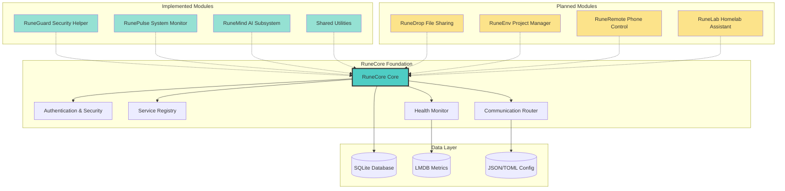
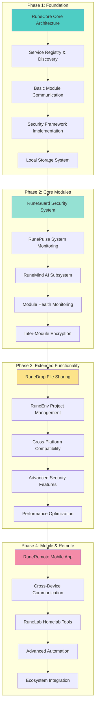
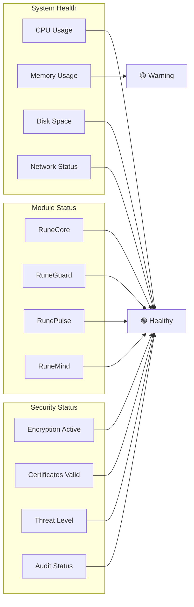

# RuneCore Ecosystem

> **Status:** Foundation Development | **Platform:** WSL2, Arch Linux, Debian/Ubuntu  
> **Architecture:** Modular Microservice Environment  
> **Last Updated:** October 19, 2025

RuneCore is a modular personal computing environment built around a central core system. It provides integrated tools for system management, development, file sharing, and cross-device control through a unified, secure ecosystem.

## System Architecture



## Core Architecture

### Foundation Components
- **Central RuneCore**: Mandatory foundation managing all module interactions
- **Microservice Modules**: Independent services connecting through the core
- **Encrypted Communication**: AES-256 encryption for all inter-module communication
- **Service Discovery**: Core-managed registry for module location and health
- **Local Storage**: SQLite, LMDB, and configuration files - all data stays local

### Security Implementation
- **AES-256 Encryption**: Industry-standard encryption for data in transit
- **Public Key Infrastructure**: Core-managed certificate and key rotation
- **Weekly Key Rotation**: Automated security certificate renewal
- **Privilege Separation**: Modules operate at minimum required access levels
- **Local Data Only**: No cloud dependencies, all data remains on user machine

### Communication Protocol
- **JSON Messaging**: Standardized message format across all modules
- **WebSocket Connections**: Real-time communication channels
- **Core-Enforced Standards**: All module communication routed through core
- **Graceful Degradation**: Modules function independently when core unavailable

## Module Status

### Implemented (Foundation Phase)

#### RuneCore Foundation (Planned - Central Architecture)
- **Service Registry**: Module discovery and registration
- **Authentication System**: Security and access management  
- **Inter-Module Router**: Communication coordination
- **Health Monitoring**: Real-time system status tracking
- **Error Logging**: Centralized error collection and analysis

#### RuneGuard Security Helper (ErrorLogger → RuneGuard)
- **Error Monitoring**: System-wide error detection and logging
- **State Snapshotting**: Diagnostic data collection
- **Network Monitoring**: Basic traffic analysis capabilities
- **Help System**: Automated troubleshooting assistance

#### RunePulse System Monitor (hidden_toolbar → RunePulse)
- **System Metrics**: CPU, RAM, disk, network monitoring
- **TUI Interface**: Simple and advanced monitoring modes
- **Health Presets**: Gaming, Development, Minimal configurations
- **Status Indicators**: Green/Yellow/Red system health display

#### RuneMind AI Subsystem (ai_service → RuneMind)
- **Natural Language Interface**: Chat-based system interaction
- **Multiple AI Models**: Ollama integration with model management
- **System Optimization**: AI-driven performance suggestions
- **Conversation Memory**: Context-aware interaction history

#### RuneCore Shared Utilities (shared_utils)
- **Common Libraries**: Cross-module utility functions
- **Configuration Management**: Standardized settings handling
- **Communication Helpers**: Inter-module messaging utilities
- **Security Primitives**: Encryption and authentication helpers

### Planned Modules

#### RuneDrop File Sharing
- **QR Code Transfer**: Drag-to-tray file sharing via QR codes
- **Priority Handling**: Smart file type prioritization
- **Cross-Device Pairing**: Seamless device-to-device connections
- **Zero-Config Discovery**: Automatic local network detection

#### RuneEnv Project Manager  
- **Environment Automation**: Automated dev environment setup
- **Container Management**: Docker/Podman integration
- **Dependency Tracking**: Project-specific package management
- **IDE Integration**: Development tool coordination

#### RuneRemote Phone Control
- **Native Mobile App**: Kotlin/React Native implementation
- **Media Controls**: System audio and video management
- **Stream Deck**: Customizable control interface
- **Multi-Computer Support**: Cross-system device pairing

#### RuneLab Homelab Assistant
- **Server Monitoring**: Change tracking and logging
- **Backup Reminders**: Automated backup scheduling
- **SSH Management**: Connection monitoring and status
- **Quick Cards**: Server status dashboard

## Development Roadmap



## Quick Start

### System Requirements
- **WSL2** with Windows 10/11 (primary target)
- **Arch Linux** (native support)
- **Debian/Ubuntu** (stable support)
- **Kali Linux** (security-focused features)

### Installation
```bash
# Clone the RuneCore ecosystem
git clone https://github.com/datamann1013/User_Functionality_WSL.git
cd User_Functionality_WSL

# Start the RuneMind AI subsystem
cd projects/ai_service
./start_runecore_ai.sh
```

### Services Available
- **RuneCore Foundation**: http://localhost:5000 (Planned - Core API)
- **RuneGuard Security**: http://localhost:5001 (Error monitoring)
- **RuneMind AI**: http://localhost:5002 (AI interface)
- **RunePulse Dashboard**: http://localhost:3000 (System monitoring)

### Verify Installation
```bash
# Check all modules are healthy
curl http://localhost:5000/health

# List registered modules
curl http://localhost:5000/api/modules

# Test RuneMind AI interface
curl -X POST http://localhost:5000/api/ai/chat  
  -H "Content-Type: application/json"  
  -d '{"message":"What is my system status?"}'
```

## Security & Privacy

### Data Sovereignty
- **Local Storage Only**: All data remains on your machine
- **No Cloud Dependencies**: Complete offline functionality
- **User-Controlled Backups**: Manual backup and restore system
- **Zero Telemetry**: No usage data collection

### Security Features
- **End-to-End Encryption**: AES-256 for all module communication
- **Certificate Management**: Automated key rotation and PKI
- **Privilege Isolation**: Each module runs with minimal permissions
- **Network Monitoring**: Traffic analysis and threat detection

### Privacy Protection
- **Local File Indexing**: Search without external services
- **Encrypted Configuration**: Sensitive settings protection
- **Audit Logging**: Complete action tracking for security review
- **User Consent**: Explicit permission for all system changes

## Platform Support

### Primary Platforms
| Platform | Support Level | Features |
|----------|---------------|----------|
| **WSL2** | Full | Complete feature set, optimized performance |
| **Arch Linux** | Native | Full functionality, package management |
| **Debian/Ubuntu** | Stable | Core features, reliable operation |
| **Kali Linux** | Security Focus | Enhanced security tools, penetration testing |

### Installation Methods
- **Component Scripts**: Individual module installation
- **Progressive Enhancement**: Features enabled based on platform capabilities  
- **Dependency Management**: Platform-specific package handling
- **Compatibility Layers**: Cross-platform abstraction where needed

## System Monitoring

### Health Dashboard


### Diagnostic Capabilities
- **Real-Time Metrics**: Live system performance monitoring
- **Historical Tracking**: Trend analysis and anomaly detection
- **Error Correlation**: Cross-module error pattern analysis
- **Health Scoring**: Automated system health assessment

## Development & Contributing

### Module Development
```python
# Standard RuneCore module template
from runecore import Module, register_module

class RuneNewModule(Module):
    def __init__(self):
        super().__init__("RuneNew", "1.0.0")
        
    def initialize(self):
        """Initialize module resources"""
        pass
        
    def health_check(self):
        """Return module health status"""
        return {"status": "healthy", "details": {}}
        
    def shutdown(self):
        """Cleanup module resources"""
        pass

# Register with RuneCore
register_module(RuneNewModule())
```

### Integration Standards
- **JSON Communication**: Standardized message format
- **Health Endpoints**: Required `/health` endpoint for all modules
- **Error Reporting**: Integration with RuneGuard error system
- **Configuration Management**: TOML/JSON configuration files

### Testing Framework
- **Module Testing**: Individual component validation
- **Integration Testing**: Cross-module communication testing
- **Security Testing**: Encryption and privilege validation
- **Performance Testing**: Resource usage and scaling validation

## Success Metrics

### Foundation Phase Completion
- [ ] RuneCore central architecture (Planned)
- [x] Basic module communication (via shared utilities)
- [x] Security framework implementation (via RuneGuard)
- [x] Error monitoring system (RuneGuard active)
- [x] AI subsystem implementation (RuneMind active)

### Integration Phase Goals
- [ ] All modules communicating through core
- [ ] End-to-end encryption active
- [ ] Cross-platform compatibility verified
- [ ] Performance benchmarks established
- [ ] Security audit completed

### Ecosystem Phase Targets
- [ ] Mobile app integration
- [ ] Advanced automation features
- [ ] Complete homelab management
- [ ] AI-driven system optimization
- [ ] Full cross-device synchronization

---

**RuneCore**: Building the future of personal computing environments, one module at a time.ionality WSL

