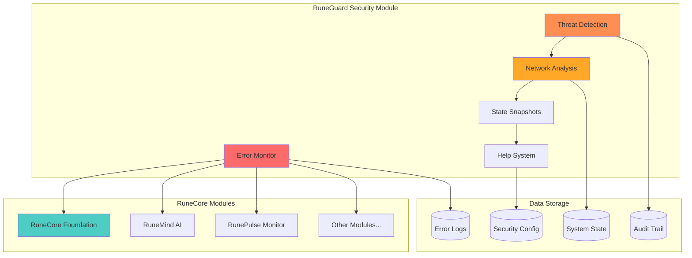
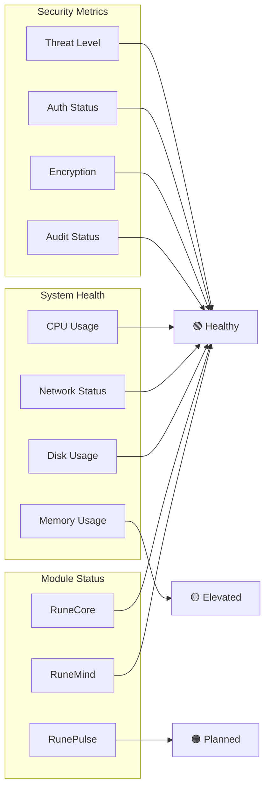

# RuneGuard Security & Helper

> **Status**: ✅ Production Ready | **Role**: Security & Monitoring Module  
> **Integration**: RuneCore Foundation | **Port**: 5001  
> **Last Updated**: October 19, 2025

RuneGuard serves as the security and diagnostic module of the RuneCore ecosystem, providing comprehensive error monitoring, state snapshotting, network traffic analysis, and automated troubleshooting assistance for all connected modules.

## Security & Monitoring Features

### Core Security Functions
- **System-Wide Error Detection**: Real-time monitoring across all RuneCore modules
- **Threat Pattern Recognition**: Analysis of error patterns for security threats
- **Network Traffic Monitoring**: Basic traffic analysis and anomaly detection
- **State Snapshotting**: Diagnostic data collection for system analysis
- **Audit Trail**: Complete logging of all security-related events

### Diagnostic Capabilities
- **Help System**: Automated troubleshooting assistance with context awareness
- **Error Correlation**: Cross-module error pattern analysis
- **Performance Monitoring**: Resource usage tracking and optimization suggestions
- **Health Scoring**: Automated system health assessment
- **Recovery Assistance**: Guided system recovery procedures

### RuneCore Integration
- **Foundation Communication**: Secure integration with RuneCore Foundation
- **Module Monitoring**: Health tracking for all connected RuneCore modules
- **Centralized Logging**: Unified error collection across the ecosystem
- **Security Reporting**: Real-time security status to Foundation core
- **Encrypted Data**: AES-256 encryption for all sensitive information

## RuneGuard Architecture



## 🚨 Error Code Structure

RuneGuard uses a structured error code system for precise error identification and automated response:

| Segment       | Values      | Description                     |
|---------------|-------------|---------------------------------|
| Type (1 char) | E, W, I     | Error, Warning, Info           |
| Origin (1)    | R, G, M, P  | RuneCore, RuneGuard, RuneMind, RunePulse |
| Component (1) | S, B, F, N  | Setup, Backend, Frontend, Network |
| Subcomponent  | A-Z, #      | Specific module or # for general |
| Number (2)    | 00-99       | Unique error ID                |

### Example Error Codes
- `ERGS01` - RuneCore + RuneGuard + Setup + Security + Error 01
- `WMNA12` - Warning + RuneMind + Network + API + Error 12  
- `IPBH05` - Info + RunePulse + Backend + Health + Info 05

## Security Monitoring

### Network Traffic Analysis
```python
# Basic network monitoring
from runeguard import NetworkMonitor

monitor = NetworkMonitor()
monitor.start_monitoring()

# Detect suspicious patterns
threats = monitor.analyze_traffic()
for threat in threats:
    runeguard.log_security_event(threat)
```

### Threat Detection Patterns
- **Unusual Connection Patterns**: Unexpected network activity
- **Resource Exhaustion**: Memory/CPU overuse detection
- **Authentication Failures**: Failed access attempts
- **Configuration Changes**: Unauthorized system modifications
- **Module Communication Anomalies**: Suspicious inter-module traffic

### State Snapshotting
```python
# Capture system state for diagnostics
from runeguard import StateSnapshot

snapshot = StateSnapshot()
snapshot.capture_system_state()
snapshot.include_module_status()
snapshot.save_diagnostic_data()

# Analyze for issues
issues = snapshot.analyze_health()
runeguard.generate_help_suggestions(issues)
```

## RuneGuard API

### Security Endpoints
```bash
# Get security status
GET /security/status

# Retrieve threat analysis
GET /security/threats

# Get system health score
GET /health/score

# Trigger security scan
POST /security/scan
```

### Error Logging Endpoints  
```bash
# Log error from module
POST /log
{
  "error_code": "ERGS01",
  "message": "Security configuration error",
  "exception": "ConfigurationError: Missing encryption keys",
  "extra": {"module": "RuneCore", "severity": "high"}
}

# Get error patterns
GET /errors/patterns

# Export security logs
GET /logs/export?format=json&timerange=24h
```

### Help System Endpoints
```bash
# Get help for error code
GET /help/{error_code}

# Request automated diagnosis
POST /help/diagnose
{
  "symptoms": ["slow_response", "high_memory"],
  "module": "RuneMind"
}

# Get recovery suggestions
GET /help/recovery/{error_code}
```

## Monitoring Dashboard

### Security Status Display


### Web Interface Features
- **Real-time Security Dashboard**: Live threat monitoring
- **Error Pattern Visualization**: Trend analysis and correlation
- **Help Wizard**: Interactive troubleshooting assistance
- **Audit Log Viewer**: Complete security event history
- **System Health Overview**: Comprehensive status display

## Configuration

### Security Configuration (`security_config.json`)
```json
{
  "threat_detection": {
    "enable_network_monitoring": true,
    "suspicious_connection_threshold": 100,
    "resource_usage_threshold": 80,
    "authentication_failure_limit": 5
  },
  "encryption": {
    "algorithm": "AES-256",
    "key_rotation_interval": "weekly",
    "enforce_module_encryption": true
  },
  "logging": {
    "error_retention_days": 30,
    "audit_retention_days": 90,
    "enable_security_alerts": true,
    "alert_email": null
  },
  "help_system": {
    "enable_auto_diagnosis": true,
    "provide_recovery_suggestions": true,
    "context_awareness": true
  }
}
```

### Error Code Configuration (`error_codes.json`)
```json
{
  "error_explanations": {
    "ERGS01": "Security configuration missing or invalid",
    "WMNA12": "Network API response time elevated",
    "IPBH05": "Health check completed successfully"
  },
  "severity_mapping": {
    "E": "error",
    "W": "warning", 
    "I": "info"
  },
  "auto_responses": {
    "ERGS01": "restart_security_service",
    "WMNA12": "check_network_connectivity"
  }
}
```

## Quick Start

### Installation
```bash
# Install RuneGuard dependencies
pip install -e ./projects/ErrorLogger

# Configure security settings
cp security_config.example.json security_config.json
```

### Start RuneGuard Service
```bash
# Start as part of RuneCore ecosystem
./start_runecore.sh

# Or start independently
./projects/ErrorLogger/start_runeguard.sh
```

### Integration with RuneCore Modules
```python
# RuneCore module integration
import sys
sys.path.append('/path/to/projects')
from ErrorLogger.logger import log_error_remote

def log_to_runeguard(error_code, message=None, exception=None, extra=None):
    """Log security/error event to RuneGuard"""
    if extra is None:
        extra = {}
    extra['module'] = 'RuneMind'  # or current module name
    return log_error_remote(error_code, message, exception, extra)

# Usage in RuneCore modules
try:
    # Module operation
    result = perform_sensitive_operation()
except SecurityException as e:
    log_to_runeguard('ERGS03', 'Security violation detected', exception=e)
```

## 🔍 Advanced Features

### Automated Threat Response
- **Intrusion Detection**: Automatic detection of unauthorized access
- **Response Escalation**: Graduated response to security threats  
- **Module Isolation**: Ability to isolate compromised modules
- **Emergency Shutdown**: System protection during critical threats

### Intelligent Help System
- **Context-Aware Assistance**: Help tailored to current system state
- **Learning System**: Improves recommendations based on resolution success
- **Interactive Diagnosis**: Step-by-step troubleshooting guidance
- **Knowledge Base**: Comprehensive database of solutions and workarounds

### Integration Testing
```bash
# Test RuneGuard security features
pytest projects/ErrorLogger/test_security.py

# Test help system responses
pytest projects/ErrorLogger/test_help_system.py

# Test RuneCore integration
pytest projects/ErrorLogger/test_integration.py
```

## Success Metrics

### Security Monitoring
- **Threat Detection Rate**: >95% accuracy in identifying security issues
- **False Positive Rate**: <5% incorrect threat identifications
- **Response Time**: <100ms for critical security events
- **System Coverage**: 100% of RuneCore modules monitored

### Help System Effectiveness  
- **Issue Resolution Rate**: >80% of problems resolved via help system
- **User Satisfaction**: Measured via feedback on help effectiveness
- **Knowledge Base Growth**: Continuous expansion of solution database
- **Automated Recovery**: >60% of issues resolved without user intervention

---

**RuneGuard**: Your vigilant security companion in the RuneCore ecosystem, ensuring system integrity, providing intelligent assistance, and maintaining the highest standards of operational security.

## Features

### Core Functionality
- **Structured Error Codes**: `[Type][Origin][Component][Subcomponent][Number]`
  - Type: E=Error, W=Warning, I=Info
  - Origin: A=AI Service, F=Frontend, B=Backend
  - Component: S=Setup, B=Backend, F=Frontend
  - Subcomponent: Specific module (A=API, M=Model, etc)
- **CSV Log Format**: Semicolon-delimited for easy database import
- **Standard Messages**: Automatic fallback with "(standard)" tag
- **WSL Optimized**: Special path handling for WSL environments
- **Sync Logging**: Guaranteed log delivery with response validation

### Project Integration Status
- ✅ **AI Service Backend**: Fully integrated with service identification
- ✅ **Ollama Service**: Complete error tracking and monitoring
- ⚠️ **AI Service Frontend**: Partial integration (pending Phase 1 completion)
- ✅ **Startup Scripts**: Enhanced ErrorLogger detection and management
- ✅ **Cross-Service**: Centralized logging across all components

### Web Interface
- **Real-time Monitoring**: Live error tracking dashboard
- **Error Analysis**: Pattern detection and trending
- **Service Health**: Component status monitoring
- **Log Export**: CSV and JSON export capabilities

## Log Format
```csv
timestamp;error_code;explanation;exception;extra
```

Example:
```
2023-08-04 15:30:22;EABS1;Missing required model files;FileNotFoundError;{"missing_files": ["model.bin"]}
```

## Error Code Structure
| Segment       | Values      | Description                     |
|---------------|-------------|---------------------------------|
| Type (1 char) | E, W, I     | Error, Warning, Info           |
| Origin (1)    | A, F, B     | AI Service, Frontend, Backend  |
| Component (1) | S, B, F, X  | Setup, Backend, Frontend, General |
| Subcomponent  | A-Z, #      | Specific module or # for general |
| Number (2)    | 00-99       | Unique error ID                |

Example: `EABS1` = Error + AI Service + Backend + Setup + ID 01

## Installation
```bash
pip install -e ./projects/ErrorLogger
```

## Configuration
The logger uses `config.json` for settings. Example configuration:
```json
{
  "error_explanations": {
    "EABS1": "Missing required model files",
    "EABB1": "Inference failed - model loading issue"
  },
  "logging": {
    "enable_console_debug": false,
    "log_retention_days": 30,
    "max_log_file_size_mb": 10
  },
  "service": {
    "remote_url": "http://localhost:5001/log",
    "timeout_seconds": 5,
    "retry_attempts": 1
  }
}
```

**Log Rotation**: Automatic size-based rotation with time-based cleanup
- Files rotate when they reach `max_log_file_size_mb` (default: 10MB)
- Old files auto-delete after `log_retention_days` (default: 30 days)
- Cleanup runs once daily (low overhead)

**Fallback**: If `config.json` is missing or incomplete, the system automatically falls back to `error_codes.py` definitions.

**Debug Mode**: Set `enable_console_debug: true` in config or use `DEBUG=1` environment variable for console output.

## Usage

### AI Service Integration (Recommended)
```python
# AI Service backend integration (auto-service identification)
sys.path.append('/home/administrator/gitcontrol/User_Functionality_WSL/projects')
from ErrorLogger.logger import log_error_remote

def log_to_errorlogger(error_code, message=None, exception=None, extra=None):
    """Log to ErrorLogger with proper service identification"""
    if extra is None:
        extra = {}
    extra['service'] = 'ai_service'  # Auto-identifies service
    return log_error_remote(error_code, message, exception, extra)

# Usage in AI service
try:
    agent = db.create_agent(agent_data)
except Exception as e:
    log_to_errorlogger('EABD02', 'Failed to create agent', exception=e)
```

### Direct Python Logging
```python
from ErrorLogger.logger import log_error_remote

try:
    # Your code here
except Exception as e:
    log_error_remote(
        "EABB1",
        message="Inference failed",
        exception=str(e),
        extra={"model": "llama3.2:1b", "service": "ollama_service"}
    )
```

### React Logging (Frontend)
```javascript
// errorLogger.js
export function logReactError(code, message, error, extra) {
  fetch('http://localhost:5001/log', {
    method: 'POST',
    headers: {'Content-Type': 'application/json'},
    body: JSON.stringify({
      error_code: code,
      message: message,
      exception: error.toString(),
      extra: extra
    })
  });
}

// Usage
try {
  // Component logic
} catch (error) {
  logReactError('EAFX1', 'UI render failed', error, {component: 'ChatWindow'});
}
```

### Starting Service
```bash
error-logger  # Starts on port 5001
```

## Testing
```bash
pytest projects/ErrorLogger/test_logger.py
```

## Viewing Logs
Logs are stored in the `logs/` directory within the project:
```bash
# View all logs
tail -f logs/errorlog_*.csv

# View latest log file only
tail -f $(ls -t logs/errorlog_*.csv | head -1)

# View logs from project root
cd /path/to/User_Functionality_WSL
tail -f logs/errorlog_*.csv
```

## Log Rotation Monitoring
```python
from ErrorLogger.logger import get_log_rotation_status

status = get_log_rotation_status()
print(f"Current file: {status['current_file_size_mb']}MB")
print(f"Will rotate: {status['will_rotate_soon']}")
print(f"Total files: {status['total_log_files']}")
```

## Adding New Error Codes
1. Edit `error_codes.py`
2. Add new codes with explanations
3. Follow naming convention