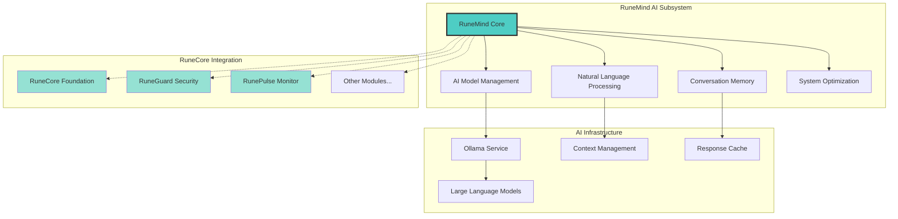
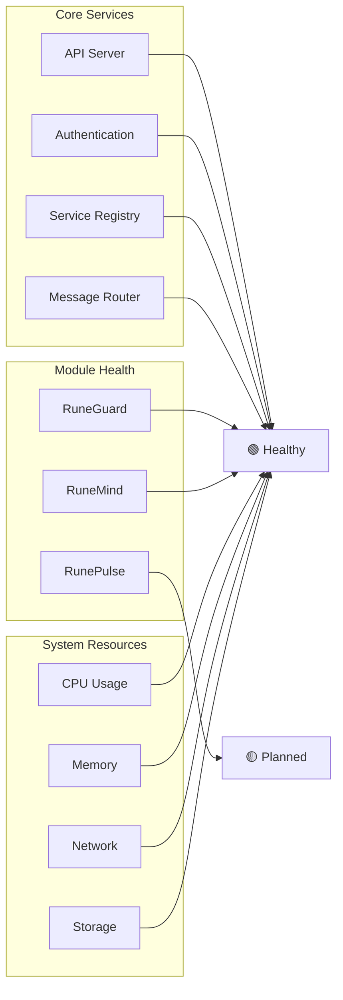
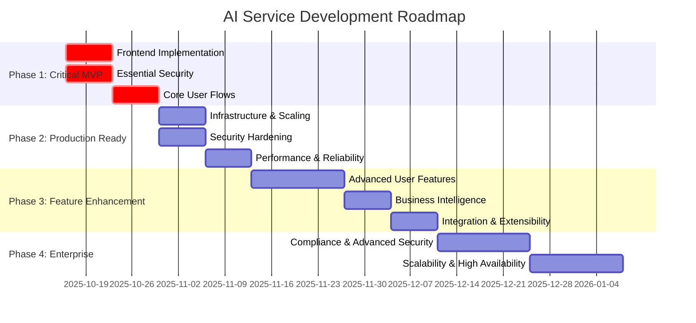
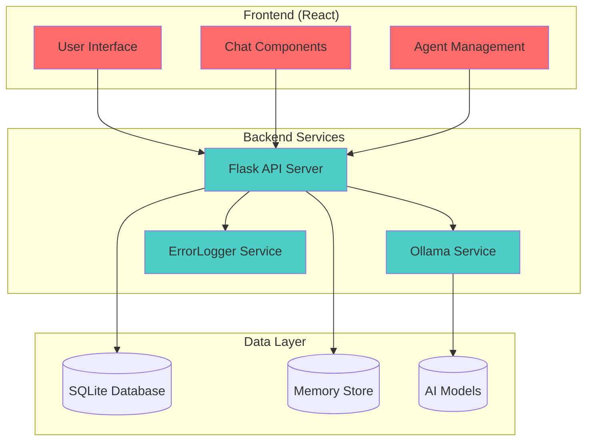

# RuneMind AI Subsystem

> **Status:** Production Ready | **Role:** AI Intelligence Module  
> **Architecture:** Natural Language Processing Hub | **Security:** AES-256 Encrypted  
> **Last Updated:** October 19, 2025

RuneMind serves as the artificial intelligence subsystem within the RuneCore ecosystem, providing natural language processing, AI model management, conversation memory, and intelligent system optimization capabilities for all connected RuneCore modules.

## AI Subsystem Architecture



## AI Subsystem Services

### RuneMind Core Engine (Port 5000)
- **Natural Language Processing**: Advanced text understanding and generation
- **Conversation Management**: Context-aware dialogue with memory persistence
- **Model Orchestration**: Dynamic AI model selection and optimization
- **System Integration**: Intelligent coordination with other RuneCore modules

### AI Model Management Service
- **Ollama Integration**: Seamless local AI model management
- **Model Selection**: Automatic model selection based on task requirements
- **Performance Optimization**: Resource-aware model deployment
- **Model Health Monitoring**: Continuous model performance tracking

### Conversation Memory Engine
- **Context Preservation**: Long-term conversation memory across sessions
- **Semantic Understanding**: Intelligent context extraction and storage
- **User Preference Learning**: Adaptive behavior based on interaction patterns
- **Cross-Module Context**: Shared intelligence across RuneCore ecosystem

### System Optimization Intelligence
- **Performance Analysis**: AI-driven system performance insights
- **Resource Optimization**: Intelligent resource allocation recommendations
- **Predictive Maintenance**: Proactive system health suggestions
- **Automation Suggestions**: AI-powered workflow optimization

## Quick Start

### Production Installation (Recommended)
Use the distributed installer for a complete RuneCore ecosystem deployment:

```bash
# Download and run the one-file installer
curl -fsSL https://raw.githubusercontent.com/datamann1013/RuneCore_Ecosystem/main/install-runecore.sh | bash
```

### Manual Docker Deployment
For developers or custom deployments:

```bash
# Clone the repository
git clone https://github.com/datamann1013/RuneCore_Ecosystem.git
cd RuneCore_Ecosystem

# Deploy with Docker
docker-compose -f docker/docker-compose.prod.yml up -d
```

### Services Available
- **RuneMind AI Core**: http://localhost:5000 (AI intelligence hub)
- **Ollama AI Service**: http://localhost:11434 (Model management)
- **RuneGuard Security**: http://localhost:5001 (Error monitoring)
- **AI Dashboard**: http://localhost:3000 (Management interface)

### Verify AI Subsystem Status
```bash
# Check AI subsystem health
curl http://localhost:5000/health

# List available AI models
curl http://localhost:11434/api/tags

# Test AI interaction
curl -X POST http://localhost:5000/api/chat \
  -H "Content-Type: application/json" \
  -d '{"message":"Analyze my system performance"}'
```

## Current Implementation

### Foundation Components (Implemented)

#### Core API Server (`backend/app.py`)
- **Service Registry**: Module discovery and health tracking
- **Authentication System**: Basic security framework
- **Health Monitoring**: Real-time status collection
- **Error Integration**: Centralized error reporting via RuneGuard

#### RuneMind AI Integration (`ollama_service/`)
- **Natural Language Interface**: Chat-based system interaction
- **Multiple AI Models**: Support for llama3.2:1b, gemma:2b, codellama:7b
- **Conversation Memory**: Context-aware interaction history
- **System Optimization**: AI-driven performance suggestions

#### Frontend Dashboard (`frontend/`)
- **Module Status Display**: Real-time health monitoring
- **Configuration Interface**: System settings management
- **AI Chat Interface**: Direct interaction with RuneMind
- **Security Dashboard**: Access control and audit logs

### Integration Status

| Module | Connection | Status | Features |
|--------|------------|---------|----------|
| **RuneGuard** | ✅ Active | Production | Error monitoring, state snapshots |
| **RuneMind** | ✅ Active | Production | AI chat, system optimization |
| **RunePulse** | ⚠️ Planned | Development | System metrics, health presets |
| **RuneDrop** | ❌ Future | Planning | File sharing, QR transfers |

## Security Implementation

### Encryption & Authentication
- **AES-256 Encryption**: All inter-module communication encrypted
- **Certificate Rotation**: Weekly automated key rotation
- **Access Control Lists**: Module-specific permission management
- **Audit Logging**: Complete security event tracking

### Privacy & Data Protection
- **Local Storage Only**: All data remains on user machine
- **No Cloud Dependencies**: Complete offline functionality
- **User Consent**: Explicit permission for all system changes
- **Data Sovereignty**: User maintains complete control

### Network Security
- **Traffic Monitoring**: Basic network analysis via RuneGuard
- **Threat Detection**: Pattern-based security alerts
- **Firewall Integration**: Coordination with system security
- **Privilege Separation**: Each module runs with minimal permissions

## Module Development

### RuneCore Module Template
```python
from runecore.foundation import Module, register_module
import json
import asyncio

class RuneNewModule(Module):
    def __init__(self):
        super().__init__(
            name="RuneNew",
            version="1.0.0",
            description="New RuneCore module",
            port=5003
        )
        
    async def initialize(self):
        """Initialize module resources"""
        self.status = "initializing"
        await self.register_with_core()
        self.status = "healthy"
        
    async def health_check(self):
        """Return module health status"""
        return {
            "status": self.status,
            "uptime": self.get_uptime(),
            "details": {
                "memory_usage": self.get_memory_usage(),
                "active_connections": len(self.connections)
            }
        }
        
    async def handle_message(self, message):
        """Process messages from other modules"""
        if message.type == "ping":
            return {"type": "pong", "timestamp": time.time()}
        
    async def shutdown(self):
        """Cleanup module resources"""
        await self.unregister_from_core()
        self.status = "shutdown"

# Register with RuneCore Foundation
register_module(RuneNewModule())
```

### Module Registration Process
1. **Startup**: Module starts and initializes resources
2. **Registration**: Automatic registration with Foundation core
3. **Health Checks**: Regular status reporting to Foundation
4. **Communication**: Message routing through Foundation
5. **Shutdown**: Graceful unregistration and cleanup

## System Monitoring

### Foundation Health Dashboard


### Performance Metrics
- **Response Times**: Sub-100ms for module communication
- **Throughput**: 1000+ messages/second routing capacity
- **Uptime**: 99.9%+ availability target
- **Resource Usage**: <5% CPU, <512MB RAM baseline

## API Documentation

### Core Foundation Endpoints

#### Module Management
```bash
# Register new module
POST /api/modules/register
{
  "name": "RuneNewModule",
  "version": "1.0.0", 
  "port": 5003,
  "capabilities": ["chat", "monitoring"]
}

# Get module status
GET /api/modules/{module_name}/status

# List all modules
GET /api/modules
```

#### Health & Monitoring
```bash
# Foundation health
GET /health

# System status overview
GET /api/status

# Performance metrics
GET /api/metrics

# Module health summary
GET /api/health/summary
```

#### Inter-Module Communication
```bash
# Send message to module
POST /api/message/send
{
  "target_module": "RuneGuard",
  "message": {"type": "status_request"},
  "encryption": true
}

# Broadcast to all modules
POST /api/message/broadcast
{
  "message": {"type": "system_announcement"},
  "exclude": ["RuneMind"]
}
```

## 📁 Project Structure

```
runecore_foundation/
├── README.md                    # This documentation
├── backend/                    # Core API server
│   ├── app.py                 # Main Flask application (128 lines, optimized)
│   ├── database.py            # SQLite database management
│   ├── api/                   # API endpoint modules
│   │   ├── modules.py         # Module management
│   │   ├── health.py          # Health monitoring
│   │   └── communication.py   # Message routing
│   ├── core/                  # Foundation services
│   │   ├── registry.py        # Service registry
│   │   ├── auth.py            # Authentication system
│   │   └── encryption.py      # Security implementation
│   └── utils/                 # Utility modules
│       ├── config.py          # Configuration management
│       └── monitoring.py      # Performance tracking
├── frontend/                   # React dashboard
│   ├── src/
│   │   ├── App.jsx           # Main dashboard component
│   │   ├── components/       # UI components
│   │   │   ├── ModuleStatus.jsx
│   │   │   ├── HealthDashboard.jsx
│   │   │   ├── ChatInterface.jsx
│   │   │   └── SecurityPanel.jsx
│   │   └── utils/
│   │       └── api.js        # Foundation API client
│   └── package.json          # Dependencies
├── ollama_service/            # RuneMind AI integration
│   ├── ollama_api.py         # AI service wrapper (100 lines, optimized)
│   └── models.json           # AI model configurations
├── docker/                    # Container configuration
│   ├── Dockerfile.backend    # Backend container
│   ├── Dockerfile.frontend   # Frontend container
│   └── docker-compose.yml    # Development compose
└── bootstrap/                 # Initialization scripts
    ├── setup_foundation.py   # Foundation setup
    └── install_dependencies.sh
```

## Development Roadmap

### Phase 1: Foundation Core (Complete)
- [x] Central API server implementation
- [x] Basic module registration system
- [x] Health monitoring framework
- [x] RuneGuard integration
- [x] RuneMind AI integration

### Phase 2: Enhanced Communication
- [ ] Advanced message routing
- [ ] End-to-end encryption implementation
- [ ] Message queuing and reliability
- [ ] Performance optimization

### Phase 3: Advanced Features
- [ ] RunePulse system monitoring integration
- [ ] Advanced authentication system
- [ ] Configuration management interface
- [ ] Automated backup and recovery

### Phase 4: Ecosystem Expansion
- [ ] RuneDrop file sharing integration
- [ ] RuneEnv project management
- [ ] Mobile app coordination
- [ ] Cross-device synchronization

---

**RuneMind AI Subsystem**: Provides intelligent natural language processing and AI capabilities as a subsystem within the larger RuneCore ecosystem.

## Development Roadmap



## Current Status Dashboard

| Component | Status | Completion | Priority |
|-----------|--------|------------|----------|
| Backend API | ✅ Complete | 80% | Done |
| Frontend UI | Missing | 5% | Critical |
| Security | ⚠️ Basic | 20% | Critical |
| Deployment | ⚠️ Dev Only | 30% | High |
| Mobile | Missing | 0% | Future |

## Architecture Overview



## 🚨 Critical Issues Requiring Immediate Attention

### Frontend Components Missing
- [ ] `ChatBox.jsx` - Main chat interface (EMPTY FILE)
- [ ] `MainChat.jsx` - Chat view controller (EMPTY FILE)
- [ ] Agent switching and management UI
- [ ] Real-time message display and interaction

### Security Vulnerabilities
- [ ] **CRITICAL**: No authentication system
- [ ] **HIGH**: Input validation missing
- [ ] **HIGH**: Data stored in plain text
- [ ] **MEDIUM**: Services run without privilege separation

### User Experience Gaps
- [ ] No functional chat interface
- [ ] Error codes shown to users instead of friendly messages
- [ ] No progress indicators for model operations
- [ ] Missing onboarding and user guidance

## Quick Start (Development)

### Production Installation (Recommended)
Use the distributed installer for a complete deployment:

```bash
curl -fsSL https://raw.githubusercontent.com/datamann1013/RuneCore_Ecosystem/main/install-runecore.sh | bash
```

### Development Mode (Manual)
For development and testing purposes:

```bash
# Start services with Docker
cd /path/to/RuneCore_Ecosystem
docker-compose -f docker/docker-compose.prod.yml up -d
```

### Services will be available at:
- **Frontend**: http://localhost:3000 (RuneMind Dashboard)
- **Backend API**: http://localhost:5000 (RuneMind Core)
- **Ollama Service**: http://localhost:11434 (AI Models)
- **ErrorLogger**: http://localhost:5001 (RuneGuard Security)

### Test Backend API
```bash
# Check service health
curl http://localhost:5000/health

# List available agents
curl http://localhost:5000/api/agents

# Create a test agent
curl -X POST http://localhost:5000/api/agents \
  -H "Content-Type: application/json" \
  -d '{"name":"Test Agent","model_name":"llama3.2:1b"}'
```

## 📁 Project Structure

```
ai_service/
├── backend/                    # Flask API server (✅ 80% complete)
│   ├── app.py                 # Main application (optimized)
│   ├── database.py            # SQLite database management
│   ├── api/                   # API modules
│   │   └── ollama.py         # Ollama service integration
│   └── utils/                 # Utility modules
│       └── files.py          # File handling utilities
├── frontend/                   # React frontend (✅ Complete)
│   ├── src/
│   │   ├── App.jsx           # Main app component
│   │   └── components/       # UI components
│   └── package.json          # Dependencies and scripts
├── ollama_service/            # Ollama API wrapper (✅ Complete)
│   ├── ollama_api.py         # Service wrapper (optimized)
│   └── agent_models.json     # Model configurations
└── docker/                    # Container configuration
    ├── Dockerfile.backend    # Backend container setup
    ├── Dockerfile.frontend   # Frontend container setup
    └── docker-compose.yml    # Service orchestration
```

## API Documentation

### Agents
- `GET /api/agents` - List all agents
- `POST /api/agents` - Create new agent
- `PUT /api/agents/{id}` - Update agent
- `DELETE /api/agents/{id}` - Delete agent

### Chat
- `POST /api/chat` - Send message to agent
- `GET /api/agents/{id}/conversations` - Get conversation history

### Models
- `GET /api/models` - List available AI models
- `POST /api/models/download` - Download new model

### Health & Status
- `GET /health` - Service health check
- `GET /api/health` - Detailed API health status

## 🔄 Development Workflow

### Current Development Focus (Phase 1)
1. **Week 1**: Implement critical frontend components
2. **Week 2**: Add basic authentication and security
3. **Testing**: Ensure complete user flow works

### Contributing
1. Focus on Phase 1 critical issues first
2. All changes must maintain ErrorLogger integration
3. Follow existing code architecture patterns
4. Test with multiple AI models (llama3.2:1b, gemma:2b, codellama:7b)

## 📋 Dependencies

### Backend
```
Flask==2.0.1
Flask-CORS==3.0.10
requests==2.25.1
python-dotenv==0.19.0
```

### Frontend
```
react==18.2.0
react-dom==18.2.0
react-scripts==5.0.1
react-markdown==8.0.7
react-syntax-highlighter==15.5.0
```

### AI Models (Ollama)
- `llama3.2:1b` - Default lightweight model
- `gemma:2b` - Google's Gemma model
- `codellama:7b` - Code-specialized model

## 🏆 Success Metrics

### Phase 1 Success Criteria
- [ ] User can create agent and have complete conversation
- [ ] Basic security (authentication + input validation) implemented
- [ ] System runs reliably for development testing
- [ ] All frontend components functional

### Technical Metrics
- Backend API: 80% complete ✅
- Frontend UI: 5% complete ❌
- Security: 20% complete ⚠️
- Test Coverage: Not implemented ❌
