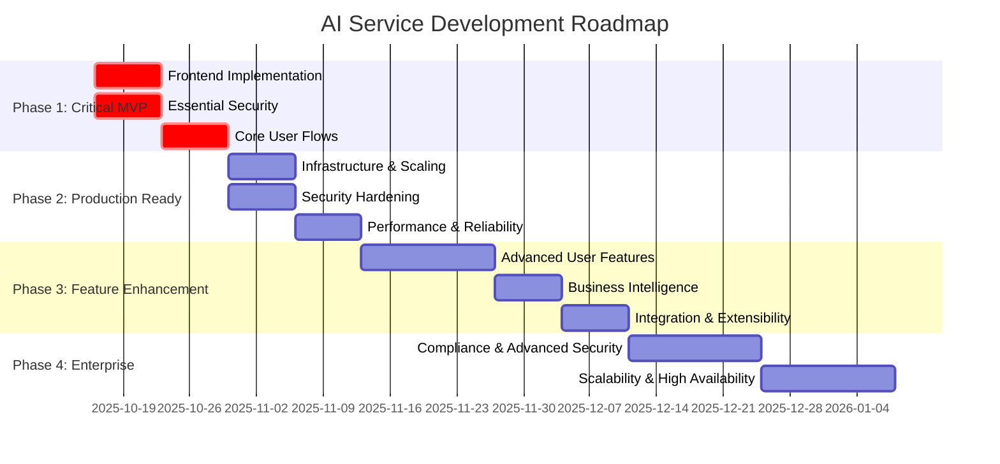
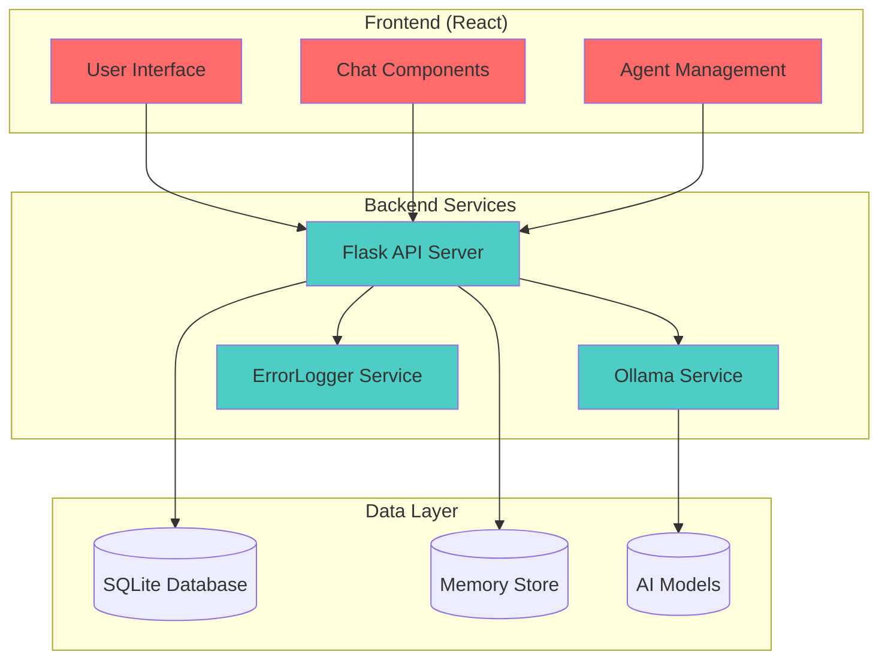

# AI Service Platform

> **Status:** Pre-Alpha (80% Backend Complete, 5% Frontend Complete)  
> **Current Phase:** Phase 1 - Critical MVP Completion  
> **Last Updated:** October 16, 2025

A multi-agent AI chat platform with advanced memory capabilities, supporting multiple Ollama models with intelligent conversation context management.

## 🚀 Development Roadmap



## 📊 Current Status Dashboard

| Component | Status | Completion | Priority |
|-----------|--------|------------|----------|
| 🔧 Backend API | ✅ Complete | 80% | ✅ Done |
| 🎨 Frontend UI | ❌ Missing | 5% | 🚨 Critical |
| 🔒 Security | ⚠️ Basic | 20% | 🚨 Critical |
| 🚀 Deployment | ⚠️ Dev Only | 30% | ⚠️ High |
| 📱 Mobile | ❌ Missing | 0% | 🔄 Future |

## 🏗️ Architecture Overview



## 🚨 Critical Issues Requiring Immediate Attention

### Frontend Components Missing
- [ ] `ChatBox.jsx` - Main chat interface (EMPTY FILE)
- [ ] `MainChat.jsx` - Chat view controller (EMPTY FILE)
- [ ] Agent switching and management UI
- [ ] Real-time message display and interaction

### Security Vulnerabilities
- [ ] **CRITICAL**: No authentication system
- [ ] **HIGH**: Input validation missing
- [ ] **HIGH**: Data stored in plain text
- [ ] **MEDIUM**: Services run without privilege separation

### User Experience Gaps
- [ ] No functional chat interface
- [ ] Error codes shown to users instead of friendly messages
- [ ] No progress indicators for model operations
- [ ] Missing onboarding and user guidance

## 🛠️ Quick Start (Development)

### Prerequisites
- Python 3.8+
- Node.js 16+
- Ollama installed locally

### 1. Start All Services
```bash
cd /path/to/ai_service
./start_ai_service.sh
```

### 2. Services will be available at:
- **Frontend**: http://localhost:3000 (⚠️ Currently non-functional)
- **Backend API**: http://localhost:5000
- **Ollama Service**: http://localhost:5002
- **ErrorLogger**: http://localhost:5001

### 3. Test Backend API
```bash
# Check service health
curl http://localhost:5000/health

# List available agents
curl http://localhost:5000/api/agents

# Create a test agent
curl -X POST http://localhost:5000/api/agents \
  -H "Content-Type: application/json" \
  -d '{"name":"Test Agent","model_name":"llama3.2:1b"}'
```

## 📁 Project Structure

```
ai_service/
├── backend/                    # Flask API server (✅ 80% complete)
│   ├── app.py                 # Main application (374 lines, optimized)
│   ├── database.py            # SQLite database management
│   ├── api/                   # API modules
│   │   └── ollama.py         # Ollama service integration
│   └── utils/                 # Utility modules
│       └── files.py          # File handling utilities
├── frontend/                   # React frontend (❌ 5% complete)
│   ├── src/
│   │   ├── App.jsx           # Main app component (622 lines)
│   │   └── componens/        # UI components (MOST EMPTY)
│   └── package.json          # Dependencies and scripts
├── ollama_service/            # Ollama API wrapper (✅ Complete)
│   ├── ollama_api.py         # Service wrapper (467 lines)
│   └── agent_models.json     # Model configurations
└── start_ai_service.sh       # Master startup script (548 lines)
```

## 🔧 API Documentation

### Agents
- `GET /api/agents` - List all agents
- `POST /api/agents` - Create new agent
- `PUT /api/agents/{id}` - Update agent
- `DELETE /api/agents/{id}` - Delete agent

### Chat
- `POST /api/chat` - Send message to agent
- `GET /api/agents/{id}/conversations` - Get conversation history

### Models
- `GET /api/models` - List available AI models
- `POST /api/models/download` - Download new model

### Health & Status
- `GET /health` - Service health check
- `GET /api/health` - Detailed API health status

## 🔄 Development Workflow

### Current Development Focus (Phase 1)
1. **Week 1**: Implement critical frontend components
2. **Week 2**: Add basic authentication and security
3. **Testing**: Ensure complete user flow works

### Contributing
1. Focus on Phase 1 critical issues first
2. All changes must maintain ErrorLogger integration
3. Follow existing code architecture patterns
4. Test with multiple AI models (llama3.2:1b, gemma:2b, codellama:7b)

## 📋 Dependencies

### Backend
```
Flask==2.0.1
Flask-CORS==3.0.10
requests==2.25.1
python-dotenv==0.19.0
```

### Frontend
```
react==18.2.0
react-dom==18.2.0
react-scripts==5.0.1
react-markdown==8.0.7
react-syntax-highlighter==15.5.0
```

### AI Models (Ollama)
- `llama3.2:1b` - Default lightweight model
- `gemma:2b` - Google's Gemma model
- `codellama:7b` - Code-specialized model

## 🏆 Success Metrics

### Phase 1 Success Criteria
- [ ] User can create agent and have complete conversation
- [ ] Basic security (authentication + input validation) implemented
- [ ] System runs reliably for development testing
- [ ] All frontend components functional

### Technical Metrics
- Backend API: 80% complete ✅
- Frontend UI: 5% complete ❌
- Security: 20% complete ⚠️
- Test Coverage: Not implemented ❌
