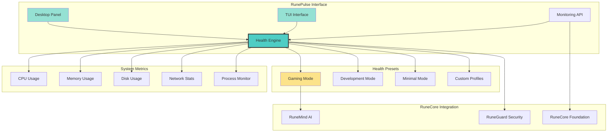

# RunePulse System Monitor

> **Status**: ✅ Stable Base | **Role**: System Monitoring Module  
> **Integration**: RuneCore Foundation | **Environment**: WSL2 + Arch Linux + Openbox  
> **Last Updated**: October 19, 2025

RunePulse serves as the comprehensive system monitoring module of the RuneCore ecosystem, providing real-time system metrics, health presets, and intelligent status indicators through both a minimal desktop interface and advanced TUI monitoring capabilities.

## Monitoring Architecture



## Core Features

### Real-Time System Monitoring
- **CPU Metrics**: Usage, temperature, frequency, core-specific data
- **Memory Analysis**: RAM usage, swap utilization, memory pressure
- **Disk Monitoring**: Storage usage, I/O throughput, health status
- **Network Tracking**: Bandwidth usage, connection status, latency
- **Process Management**: Resource consumption, security analysis

### Health Presets & Profiles
- **Gaming Mode**: Optimized for low latency, high performance
- **Development Mode**: Balanced resources, development tool optimization
- **Minimal Mode**: Low resource usage, essential services only
- **Custom Profiles**: User-defined optimization configurations

### Multi-Interface Design
- **Desktop Panel**: Minimal hover-activated toolbar with quick status
- **TUI Interface**: Advanced terminal-based monitoring dashboard
- **API Endpoints**: Integration with RuneCore Foundation and modules
- **Health Indicators**: Simple Green/Yellow/Red status system

### Intelligent Analysis
- **Anomaly Detection**: Historical trend analysis for unusual patterns
- **Performance Optimization**: AI-driven suggestions via RuneMind integration
- **Resource Prediction**: Proactive warnings for resource exhaustion
- **Health Scoring**: Automated system health assessment

## Desktop Panel Interface

### Minimal Desktop Presence
- **Small Bump Design**: Appears as discrete element at bottom center
- **Hover Activation**: Panel expands with system status on mouse over
- **Fullscreen Detection**: Automatically hides when applications are fullscreen
- **Quick Actions**: Terminal, file manager, and app launcher shortcuts
- **Status Indicators**: Color-coded system health at a glance

### Panel Components
```
[🖥️] [📁] [🔍] [🟢] [75%] [8GB] [45°C]
 │     │     │     │     │     │     └── CPU Temperature
 │     │     │     │     │     └────── Memory Usage
 │     │     │     │     └──────────── CPU Usage
 │     │     │     └────────────────── Health Status
 │     │     └──────────────────────── App Launcher (rofi)
 │     └────────────────────────────── File Manager (pcmanfm)
 └──────────────────────────────────── Terminal (alacritty)
```

### Health Status Colors
- **🟢 Green**: System operating normally, all metrics within optimal ranges
- **🟡 Yellow**: Elevated usage or minor issues detected, monitoring required
- **🔴 Red**: Critical issues or resource exhaustion, immediate attention needed

## TUI Interface

### Advanced Monitoring Dashboard
```
┌─ RunePulse System Monitor ─────────────────────────────────────┐
│ Mode: Development | Health: 🟢 Healthy | Uptime: 2d 14h 23m   │
├────────────────────────────────────────────────────────────────┤
│ CPU Usage    [████████░░] 80%  | Memory      [██████░░░░] 60%  │
│ Temperature  45°C (Normal)     | Swap        [░░░░░░░░░░] 0%   │
│ Frequency    3.2GHz (Boost)    | Disk /      [███░░░░░░░] 30%  │
├────────────────────────────────────────────────────────────────┤
│ Network Interface: eth0                                        │
│ ↓ Down: 125.3 Mbps            ↑ Up: 45.7 Mbps                │
│ Latency: 12ms                 Packets Lost: 0.1%              │
├────────────────────────────────────────────────────────────────┤
│ Top Processes by CPU:                                          │
│ 1. firefox          15.2%     512MB                           │
│ 2. code             8.7%      256MB                           │
│ 3. runecore         3.1%      128MB                           │
├────────────────────────────────────────────────────────────────┤
│ RuneCore Module Status:                                        │
│ • Foundation  🟢 Healthy   • RuneGuard   🟢 Monitoring        │
│ • RuneMind    🟢 Active    • RunePulse   🟢 This Module       │
└────────────────────────────────────────────────────────────────┘
```

### TUI Features
- **Real-time Updates**: Live data refresh with configurable intervals
- **Interactive Controls**: Keyboard navigation and configuration
- **Detailed Metrics**: Comprehensive system information display
- **Historical Graphs**: Trend visualization for key metrics
- **Module Integration**: RuneCore ecosystem status display

## Health Presets

### Gaming Mode Configuration
```json
{
  "name": "Gaming Mode",
  "description": "Optimized for low latency gaming performance",
  "settings": {
    "cpu_governor": "performance",
    "gpu_power_mode": "maximum",
    "network_priority": "gaming",
    "background_processes": "minimal",
    "update_interval": "250ms",
    "alerts": {
      "cpu_temp_threshold": 75,
      "memory_threshold": 85,
      "latency_threshold": 20
    }
  }
}
```

### Development Mode Configuration
```json
{
  "name": "Development Mode", 
  "description": "Balanced performance for development workflows",
  "settings": {
    "cpu_governor": "powersave",
    "background_services": "full",
    "ide_optimization": true,
    "compilation_priority": "high",
    "update_interval": "1000ms",
    "alerts": {
      "cpu_usage_threshold": 80,
      "memory_threshold": 75,
      "disk_io_threshold": 90
    }
  }
}
```

### Minimal Mode Configuration
```json
{
  "name": "Minimal Mode",
  "description": "Low resource usage for battery conservation",
  "settings": {
    "cpu_governor": "powersave", 
    "background_processes": "essential_only",
    "refresh_rate": "reduced",
    "networking": "on_demand",
    "update_interval": "5000ms",
    "alerts": {
      "battery_threshold": 20,
      "temperature_threshold": 60,
      "memory_threshold": 90
    }
  }
}
```

## 🔌 RuneCore Integration

### Foundation Communication
```python
# Report system status to RuneCore Foundation
from runepulse import SystemMonitor, RuneCoreReporter

monitor = SystemMonitor()
reporter = RuneCoreReporter()

# Continuous monitoring loop
while monitor.is_active():
    metrics = monitor.collect_metrics()
    health_status = monitor.analyze_health(metrics)
    
    # Report to Foundation
    reporter.send_status_update({
        "module": "RunePulse",
        "health": health_status,
        "metrics": metrics,
        "timestamp": time.time()
    })
```

### RuneGuard Security Integration
```python
# Report security-relevant metrics to RuneGuard
def check_security_metrics():
    suspicious_processes = monitor.detect_suspicious_activity()
    resource_exhaustion = monitor.check_resource_limits()
    
    if suspicious_processes:
        runeguard.log_security_event("IPMS01", 
            "Suspicious process activity detected",
            extra={"processes": suspicious_processes})
    
    if resource_exhaustion:
        runeguard.log_warning("WPBR02",
            "Resource exhaustion approaching",
            extra={"resources": resource_exhaustion})
```

### RuneMind AI Integration
```python
# Get AI-driven optimization suggestions
def get_optimization_suggestions():
    current_metrics = monitor.get_current_state()
    usage_patterns = monitor.get_historical_data(hours=24)
    
    suggestions = runemi.nd.analyze_performance({
        "current_state": current_metrics,
        "historical_data": usage_patterns,
        "active_preset": monitor.current_preset
    })
    
    return suggestions
```

## Quick Start

### System Requirements
- **WSL2** with X11 forwarding (VcXsrv)
- **Arch Linux** packages: `python-gobject gtk3 xdotool picom`
- **Desktop Environment**: Openbox or similar lightweight WM
- **Python 3.8+** with system monitoring libraries

### Installation
```bash
# Install system dependencies
sudo pacman -S python-gobject gtk3 xdotool xorg-xprop wmctrl picom

# Install RunePulse
cd projects/hidden_toolbar  # Will be renamed to runepulse
pip install -r requirements.txt
```

### Start RunePulse
```bash
# Start as part of RuneCore ecosystem
./start_runecore.sh

# Or start desktop panel independently  
cd src && python3 main.py

# Start TUI interface
python3 -m runepulse.tui

# Background mode
(python3 main.py &)
```

### Configuration
```bash
# Edit health presets
nano config/health_presets.json

# Configure monitoring thresholds
nano config/monitoring.json

# Set desktop panel preferences
nano config/desktop_panel.json
```

## API Endpoints

### System Metrics
```bash
# Get current system status
GET /api/metrics/current

# Get historical data
GET /api/metrics/history?timerange=24h

# Get health assessment
GET /api/health/status

# Get active preset
GET /api/presets/active
```

### Health Management
```bash
# Switch health preset
POST /api/presets/activate
{
  "preset": "gaming_mode",
  "duration": 3600
}

# Create custom preset
POST /api/presets/create
{
  "name": "My Custom Preset",
  "settings": {...}
}

# Get optimization suggestions
GET /api/optimization/suggestions
```

### Desktop Panel Control
```bash
# Show/hide panel
POST /api/panel/toggle

# Update panel layout
PUT /api/panel/layout
{
  "position": "bottom_center",
  "size": "compact",
  "auto_hide": true
}
```

## Development & Customization

### Custom Monitoring Plugins
```python
from runepulse.plugin import MonitoringPlugin

class CustomGPUMonitor(MonitoringPlugin):
    def collect_metrics(self):
        return {
            "gpu_usage": self.get_gpu_usage(),
            "gpu_memory": self.get_gpu_memory(),
            "gpu_temperature": self.get_gpu_temperature()
        }
    
    def health_check(self, metrics):
        if metrics["gpu_temperature"] > 80:
            return {"status": "warning", "message": "GPU overheating"}
        return {"status": "healthy"}

# Register plugin
runepulse.register_plugin(CustomGPUMonitor())
```

### Desktop Panel Customization
```python
# Custom panel widgets
from runepulse.desktop import PanelWidget

class NetworkSpeedWidget(PanelWidget):
    def render(self):
        speed = self.get_network_speed()
        return f"↓{speed.down} ↑{speed.up}"
    
    def on_click(self):
        subprocess.run(["nm-connection-editor"])

# Add to panel
panel.add_widget(NetworkSpeedWidget())
```

## Success Metrics

### Performance Monitoring
- **Response Time**: <50ms for metric collection
- **Accuracy**: >99% for system metric reporting  
- **Coverage**: Monitor 100% of system resources
- **Uptime**: >99.9% monitoring availability

### User Experience
- **Desktop Panel**: Minimal resource usage (<1% CPU)
- **TUI Interface**: Responsive updates (<100ms refresh)
- **Health Presets**: <5 second preset switching
- **Integration**: Seamless RuneCore ecosystem communication

---

**RunePulse**: Your comprehensive system monitoring companion, providing intelligent insights, proactive alerts, and seamless integration within the RuneCore ecosystem.

---

## Features

- Appears as a **small bump** at the **bottom center** of the screen
- **Invisible** when not hovered or when a window is fullscreen
- **Instantly appears** on hover
- Contains 3 icons:
  - 🖥️ Terminal (`alacritty` or `xterm`)
  - 📁 File Manager (`pcmanfm`)
  - 🔍 App Launcher (`rofi -show drun`)
- Works only on the **primary monitor**

---

## How It Works

- Built with **Python + GTK** for GUI
- Uses `xdotool` or `xprop` to detect fullscreen windows
- Uses `picom` for transparency (optional)
- Hover detection is handled via GTK events

---

## Requirements

Install dependencies:

---
sudo pacman -S python-gobject xdotool xprop wmctrl picom
pip install -r requirements.txt
---

---

## Security Considerations

- Avoid running as root
- Only use trusted icons and scripts
- Avoid embedding sensitive commands

---

## 🧩 Future Ideas

- Add animation on hover
- Support for multiple monitors
- Configurable icon set

---
## How to use:

### 0. (Assumed) Download WSL2
Command: **wsl --install**

### 0. (Optional) Reset WSL2
If you want to start fresh with a clean Linux environment:
- wsl --unregister archlinux


### 1. Install a Linux Distro (this tutorial is based on archlinux) in WSL2
You can install a distro from the Microsoft Store (e.g., Ubuntu, Debian, Arch).
For Arch, use a community installer like ArchWSL.
You can also use **wsl --install archlinux** for automated installation.
Once installed update the system with 
- sudo pacman -Syu
### 2. Install Required Packages
Install the following packages inside your WSL2 distro: 
- sudo pacman -S python python-gobject gtk3 xdotool xorg-xprop wmctrl picom rofi pcmanfm alacritty openbox
### 3. Set Up X11 Display
Install and run VcXsrv on Windows, https://vcxsrv.com/
Then, in your WSL terminal:

- export DISPLAY=$(cat /etc/resolv.conf | grep nameserver | awk '{print $2}'):0
- You can add that line to your ~/.bashrc or ~/.zshrc to make it permanent.
- Make sure the ip shown when using **echo $DISPLAY** is the same as the **(WSL (Hyper-V firewall)** when using command **ipconfig** in windows.
  - If not the same set a static address, **ipconfig** is the correct address.
### 4. Clone the Repository
- git clone https://github.com/datamann1013/User_Functionality_WSL.git 
- cd User_Functionality_WSL/projects/hidden_toolbar
### 5. Add Icons (optional)
Place your icons in the icons/ folder:
- terminal.png 
- filemanager.png 
- launcher.png
Use 32x32px PNGs for best results.

There are standard images which can be used.
### 6. Run the Toolbar
Option A: Run manually
- cd src 
- python3 main.py
To run in the background use (python3 main.py&)

Option B: Run with fullscreen detection (when in hidden_toolbar folder) **NOT IMPLEMENTED YET**
- chmod +x detect_fullscreen.sh detect_fullscreen.sh & python3 src/main.py &
### 7. Autostart on Login (Optional)
If you're using Openbox or another window manager, add this to your autostart file (e.g., ~/.config/openbox/autostart):
- /path/to/User_Functionality_WSL/projects/hidden_toolbar/detect_fullscreen.sh & python3 /path/to/User_Functionality_WSL/projects/hidden_toolbar/src/main.py &
Replace /path/to/ with the actual path to your cloned repo.
### 8. Security Notes
- Do not run the toolbar as root. 
- Only use trusted icons and scripts. 
- Avoid embedding sensitive commands in the launcher.