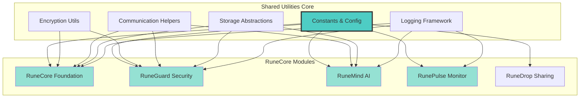

# RuneCore Shared Utilities

> **Status**: ✅ Foundation Library | **Role**: Cross-Module Support  
> **Integration**: All RuneCore Modules | **Version**: 2.0.0  
> **Last Updated**: October 19, 2025

The RuneCore Shared Utilities provide essential common functionality, constants, and configuration management used across all modules in the RuneCore ecosystem. This library ensures consistency, reduces code duplication, and provides a unified foundation for all RuneCore components.

## Architecture Overview



## Core Components

### `constants.py` - System Constants
```python
# RuneCore Foundation Configuration
RUNECORE_HOST = "127.0.0.1"
RUNECORE_PORT = 5000
RUNECORE_API_VERSION = "v1"

# Module Port Assignments
SERVICE_PORTS = {
    "runecore_foundation": 5000,
    "runeguard_security": 5001,
    "runemind_ai": 5002,
    "runepulse_monitor": 3000,
    "runedrop_sharing": 5003,
    "runeenv_projects": 5004,
    "runeremote_control": 5005,
    "runelab_homelab": 5006
}

# Security Configuration
ENCRYPTION_ALGORITHM = "AES-256"
KEY_ROTATION_INTERVAL = 604800  # 1 week in seconds
CERTIFICATE_VALIDITY = 7776000  # 90 days in seconds

# Communication Settings
MESSAGE_TIMEOUT = 5000  # milliseconds
RETRY_ATTEMPTS = 3
HEARTBEAT_INTERVAL = 30  # seconds

# Storage Configuration
DATABASE_TYPE = "sqlite"
METRICS_STORAGE = "lmdb"
CONFIG_FORMAT = "json"  # or "toml"
```

### `encryption.py` - Security Utilities
```python
from cryptography.fernet import Fernet
from cryptography.hazmat.primitives import hashes
from cryptography.hazmat.primitives.kdf.pbkdf2 import PBKDF2HMAC
import os
import base64

class RuneCoreEncryption:
    """Standardized encryption for all RuneCore modules"""
    
    def __init__(self, password: str = None):
        if password is None:
            password = os.environ.get('RUNECORE_KEY', self.generate_key())
        self.key = self._derive_key(password)
        self.cipher = Fernet(self.key)
    
    def encrypt_message(self, message: str) -> str:
        """Encrypt inter-module communications"""
        return self.cipher.encrypt(message.encode()).decode()
    
    def decrypt_message(self, encrypted_message: str) -> str:
        """Decrypt inter-module communications"""
        return self.cipher.decrypt(encrypted_message.encode()).decode()
    
    def rotate_keys(self):
        """Implement weekly key rotation"""
        new_password = self.generate_key()
        self.key = self._derive_key(new_password)
        self.cipher = Fernet(self.key)
        return new_password
    
    @staticmethod
    def generate_key() -> str:
        """Generate cryptographically secure key"""
        return base64.urlsafe_b64encode(os.urandom(32)).decode()
```

### `communication.py` - Module Communication
```python
import asyncio
import websockets
import json
from typing import Dict, Any, Optional

class RuneCoreMessenger:
    """Standardized communication for RuneCore modules"""
    
    def __init__(self, module_name: str, encryption: RuneCoreEncryption):
        self.module_name = module_name
        self.encryption = encryption
        self.foundation_url = f"ws://{RUNECORE_HOST}:{RUNECORE_PORT}/ws"
        
    async def register_module(self, capabilities: list):
        """Register module with RuneCore Foundation"""
        message = {
            "type": "module_registration",
            "module": self.module_name,
            "capabilities": capabilities,
            "timestamp": time.time()
        }
        return await self.send_to_foundation(message)
    
    async def send_to_module(self, target_module: str, message: Dict[str, Any]):
        """Send encrypted message to another module via Foundation"""
        encrypted_payload = self.encryption.encrypt_message(json.dumps(message))
        
        foundation_message = {
            "type": "inter_module_message",
            "source": self.module_name,
            "target": target_module,
            "payload": encrypted_payload,
            "timestamp": time.time()
        }
        
        return await self.send_to_foundation(foundation_message)
    
    async def broadcast_status(self, status: Dict[str, Any]):
        """Broadcast module status to Foundation"""
        message = {
            "type": "status_update",
            "module": self.module_name,
            "status": status,
            "timestamp": time.time()
        }
        return await self.send_to_foundation(message)
```

### `storage.py` - Data Management
```python
import sqlite3
import lmdb
import json
from pathlib import Path
from typing import Any, Dict, Optional

class RuneCoreStorage:
    """Unified storage interface for all RuneCore modules"""
    
    def __init__(self, module_name: str):
        self.module_name = module_name
        self.base_path = Path.home() / ".runecore" / module_name
        self.base_path.mkdir(parents=True, exist_ok=True)
        
        # SQLite for structured data
        self.db_path = self.base_path / "data.db"
        self.init_sqlite()
        
        # LMDB for metrics and high-performance data
        self.metrics_path = self.base_path / "metrics"
        self.metrics_env = lmdb.open(str(self.metrics_path), map_size=1024*1024*1024)  # 1GB
        
        # JSON/TOML for configuration
        self.config_path = self.base_path / "config.json"
    
    def store_config(self, config: Dict[str, Any]):
        """Store module configuration"""
        with open(self.config_path, 'w') as f:
            json.dump(config, f, indent=2)
    
    def load_config(self) -> Dict[str, Any]:
        """Load module configuration"""
        if self.config_path.exists():
            with open(self.config_path, 'r') as f:
                return json.load(f)
        return {}
    
    def store_metric(self, key: str, value: Any, timestamp: float = None):
        """Store high-performance metric data in LMDB"""
        if timestamp is None:
            timestamp = time.time()
            
        metric_data = {
            "value": value,
            "timestamp": timestamp,
            "module": self.module_name
        }
        
        with self.metrics_env.begin(write=True) as txn:
            txn.put(f"{key}:{timestamp}".encode(), 
                   json.dumps(metric_data).encode())
```

### `logging.py` - Unified Logging
```python
import logging
import json
from typing import Dict, Any, Optional

class RuneCoreLogger:
    """Standardized logging for all RuneCore modules"""
    
    def __init__(self, module_name: str, integration_mode: str = "runeguard"):
        self.module_name = module_name
        self.integration_mode = integration_mode
        self.setup_logging()
        
        if integration_mode == "runeguard":
            from ErrorLogger.logger import log_error_remote
            self.remote_logger = log_error_remote
    
    def setup_logging(self):
        """Configure logging with RuneCore standards"""
        self.logger = logging.getLogger(f"runecore.{self.module_name}")
        self.logger.setLevel(logging.DEBUG)
        
        # Console handler
        console_handler = logging.StreamHandler()
        console_handler.setLevel(logging.INFO)
        
        # File handler
        log_path = Path.home() / ".runecore" / self.module_name / "module.log"
        file_handler = logging.FileHandler(log_path)
        file_handler.setLevel(logging.DEBUG)
        
        # Formatter
        formatter = logging.Formatter(
            '%(asctime)s - %(name)s - %(levelname)s - %(message)s'
        )
        console_handler.setFormatter(formatter)
        file_handler.setFormatter(formatter)
        
        self.logger.addHandler(console_handler)
        self.logger.addHandler(file_handler)
    
    def log_security_event(self, error_code: str, message: str, 
                          exception: Optional[str] = None, 
                          extra: Optional[Dict[str, Any]] = None):
        """Log security event to RuneGuard"""
        if extra is None:
            extra = {}
        extra['module'] = self.module_name
        
        if self.integration_mode == "runeguard":
            self.remote_logger(error_code, message, exception, extra)
        
        self.logger.warning(f"[{error_code}] {message}")
```

## Usage Examples

### Module Integration
```python
# Standard RuneCore module setup
from shared_utils.constants import SERVICE_PORTS, RUNECORE_HOST
from shared_utils.encryption import RuneCoreEncryption
from shared_utils.communication import RuneCoreMessenger
from shared_utils.storage import RuneCoreStorage
from shared_utils.logging import RuneCoreLogger

class RuneNewModule:
    def __init__(self):
        self.module_name = "RuneNew"
        self.port = SERVICE_PORTS.get("runenew_module", 5007)
        
        # Initialize shared components
        self.encryption = RuneCoreEncryption()
        self.messenger = RuneCoreMessenger(self.module_name, self.encryption)
        self.storage = RuneCoreStorage(self.module_name)
        self.logger = RuneCoreLogger(self.module_name)
        
    async def start(self):
        """Standard module startup"""
        # Load configuration
        self.config = self.storage.load_config()
        
        # Register with Foundation
        await self.messenger.register_module(["monitoring", "api"])
        
        # Log startup
        self.logger.log_info("Module started successfully")
```

### Configuration Management
```python
# Module-specific configuration with shared standards
from shared_utils.storage import RuneCoreStorage

storage = RuneCoreStorage("RuneMind")

# Store module configuration
config = {
    "ai_models": ["llama3.2:1b", "gemma:2b"],
    "max_memory": "4GB",
    "response_timeout": 30,
    "integration": {
        "runeguard": True,
        "runepulse": True
    }
}
storage.store_config(config)

# Load and use configuration
loaded_config = storage.load_config()
max_memory = loaded_config.get("max_memory", "2GB")
```

### Secure Communication
```python
# Inter-module communication
from shared_utils.communication import RuneCoreMessenger
from shared_utils.encryption import RuneCoreEncryption

encryption = RuneCoreEncryption()
messenger = RuneCoreMessenger("RuneMind", encryption)

# Send AI request to RuneMind
response = await messenger.send_to_module("RuneMind", {
    "type": "chat_request",
    "message": "What is my current system status?",
    "context": "system_monitoring"
})

# Broadcast status update
await messenger.broadcast_status({
    "health": "healthy",
    "cpu_usage": 45.2,
    "memory_usage": 60.8
})
```

## Utility Functions

### `helpers.py` - Common Utilities
```python
import time
import psutil
from typing import Dict, Any

def get_system_info() -> Dict[str, Any]:
    """Get standardized system information for all modules"""
    return {
        "cpu_percent": psutil.cpu_percent(interval=1),
        "memory_percent": psutil.virtual_memory().percent,
        "disk_usage": psutil.disk_usage('/').percent,
        "uptime": time.time() - psutil.boot_time(),
        "process_count": len(psutil.pids())
    }

def format_bytes(bytes_value: int) -> str:
    """Format byte values consistently across modules"""
    for unit in ['B', 'KB', 'MB', 'GB', 'TB']:
        if bytes_value < 1024.0:
            return f"{bytes_value:.1f}{unit}"
        bytes_value /= 1024.0
    return f"{bytes_value:.1f}PB"

def validate_module_config(config: Dict[str, Any], required_keys: list) -> bool:
    """Validate module configuration has required keys"""
    return all(key in config for key in required_keys)
```

## 🔄 Module Template Generator

### `template.py` - New Module Generator
```python
def generate_runecore_module(module_name: str, capabilities: list):
    """Generate template for new RuneCore module"""
    template = f"""
from shared_utils import *

class {module_name}(RuneCoreModule):
    def __init__(self):
        super().__init__(
            name="{module_name}",
            version="1.0.0",
            capabilities={capabilities}
        )
        
    async def initialize(self):
        """Initialize {module_name} module"""
        await self.register_with_foundation()
        self.logger.log_info("Module initialized")
        
    async def handle_message(self, message):
        """Handle inter-module messages"""
        return {{"status": "processed", "module": "{module_name}"}}
        
    async def health_check(self):
        """Return module health status"""
        return {{
            "status": "healthy",
            "uptime": self.get_uptime(),
            "details": {{}}
        }}

if __name__ == "__main__":
    module = {module_name}()
    asyncio.run(module.start())
"""
    return template
```

## Integration Status

### Current Module Usage
| Module | Integration Level | Components Used |
|--------|------------------|-----------------|
| **RuneCore Foundation** | ✅ Full | All components |
| **RuneGuard Security** | ✅ Active | Constants, logging, storage |
| **RuneMind AI** | ✅ Active | Communication, encryption, storage |
| **RunePulse Monitor** | ⚠️ Partial | Constants, logging |
| **Future Modules** | 🔄 Planned | All components |

### Development Standards
- **Code Style**: Black formatter, type hints, docstrings
- **Testing**: pytest with >90% coverage requirement
- **Documentation**: Comprehensive inline and API documentation
- **Security**: All sensitive operations use shared encryption
- **Performance**: <10ms overhead for shared utility calls

---

**RuneCore Shared Utilities**: The foundational library powering the entire RuneCore ecosystem with secure, efficient, and standardized functionality across all modules.

## Purpose

This module provides:
- **Shared Constants**: Common configuration values used across projects
- **Cross-Project Compatibility**: Ensures consistent behavior between components
- **Centralized Configuration**: Single source of truth for shared settings

## Contents

### `constants.py`
Contains shared constants and configuration values used across multiple projects:
- Service URLs and port configurations
- Common file paths and directory structures
- Error code prefixes and categories
- Default timeout and retry values

## Usage

```python
# Import shared constants in any project
import sys
import os
sys.path.append(os.path.join(os.path.dirname(__file__), '..', 'shared_utils'))
from constants import DEFAULT_TIMEOUT, SERVICE_PORTS

# Use in your code
timeout = DEFAULT_TIMEOUT
port = SERVICE_PORTS['errorlogger']
```

## Integration Status

| Project | Integration | Usage |
|---------|-------------|-------|
| **AI Service** | ✅ Active | Service configurations, error prefixes |
| **ErrorLogger** | ✅ Active | Error code structures, service identification |
| **Hidden Toolbar** | ⚠️ Minimal | Future integration planned |

## Future Enhancements

- **Configuration Management**: Centralized config file handling
- **Path Utilities**: Cross-platform path resolution helpers
- **Service Discovery**: Common service location and health check utilities
- **Logging Helpers**: Shared logging configuration and formatters
